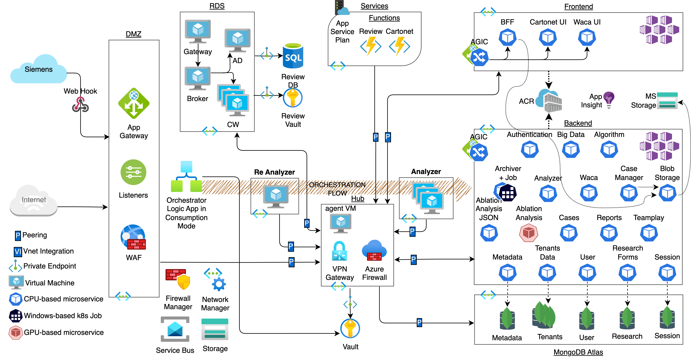
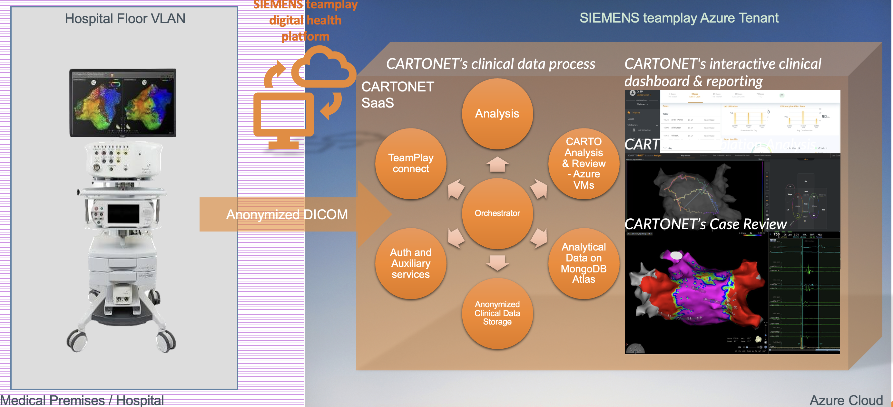
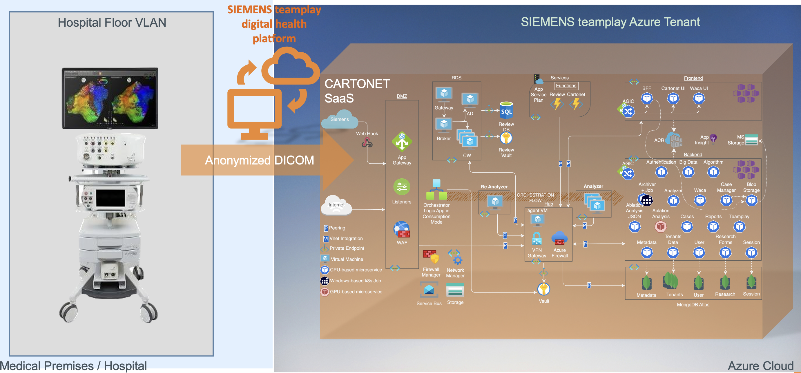

# CARTONET®: Advanced CARTO® Clinical Data Insights & ML Analytics 

## Introduction
CARTONET® pursues innovation in post-op healthcare analytics. It's designed to delve deep into CARTO 3 System clinical data, extracting invaluable insights through the power of machine learning. Beyond analytics, CARTONET provides a comprehensive platform for reviewing and researching medical cases, leveraging the robust capabilities of cloud technologies.

## Key Features:

- **Secure Cloud-Based Smart Storage Solution**: CARTONET™ provides secure storage for CARTO® 3 System cases, meeting industry best practices of security and privacy and supports compliance with HIPAA and GDPR.

- **Remote Case Review**: Using a powerful graphic server on the Azure cloud, CARTONET™ Remote Case Review enables users to retrospectively open a case remotely, like reviewing cases on a CARTO® 3 System workstation.

- **CARTO® 3 Case Data & Analytics**: CARTONET™ provides a dashboard to view CARTO® 3 System cases and key statistics. CARTONET™ data can be filtered and analyzed.

- **Ablation & Mapping Analysis Module**: CARTONET™ allows you to perform AI based retrospective analysis on CARTO® 3 System studies. This analysis includes a machine-learning-based classification of ablation sites by anatomical structure, algorithmic identification of areas of potential re-connection in a study and machine-learning-based segmentation of the left atria.

- **Multi-Site Research Solution**: CARTONET™ enables users to participate in research across multiple sites by generating a multi-site pseudonymized case database that is used for analysis.

## Architectural Excellence:

CARTONET's architecture is founded on a **Hub/Spoke** topology, ensuring a clear separation of concerns and domains:

- **Network Manager & Azure Firewall**: At the heart of the hub, these elements govern network access between various security zones or spokes.

- **Frontend Spoke**: Strategically isolated from sensitive resources, ensuring the data and keys remain secure.

- **DMZ Spoke**: A clean zone dedicated exclusively to the Web Application Firewall (WAF), Application Gateway, and Listeners.

- **Backend Spoke**: The MVP zone of the system, Backend spoke has access to valuable assets in Azure Storage, Mongo Atlas and the Azure KeyVault. This is the “Fort Knox” of CARTONET and the ACLs are managed carefully to allow pinpoint access of outer services to the Backend.

The flow within CARTONET is orchestrated by a Logic App, ensuring processes are streamlined and consume only relevant resources. **Microservices** leverage scalability optimizations with lowest marginal costs and utter cybersecurity, and access to all kinds of storage is routed through frontier microservices, allowing for adaptability in architectural developments.

In terms of security, CARTONET goes the extra mile. All data is encrypted, whether at rest or in transit. Encryption and authentication keys are all managed in **Azure KeyVaults** and are regularly rotated. Service-to-service communication is based on Mutual Transport Layer Security (**mTLS**), for both authentication and in-transit encryption, via the **Open Service Mesh**, and every incoming request is authenticated using **Azure Active Directory** and **JWT** tokens. User and service roles are assigned to minimized permission sets.

The architecture is uniformly re-created in all environments with IaC Terraform automation pipelines, for consistent testing. The R&D cycle is automated with Azure DevOps, scanning for potential vulnerabilities, compliance, and best practices on every modification. The methodology embraces the latest and greatest from both modern cloud and healthcare worlds.

