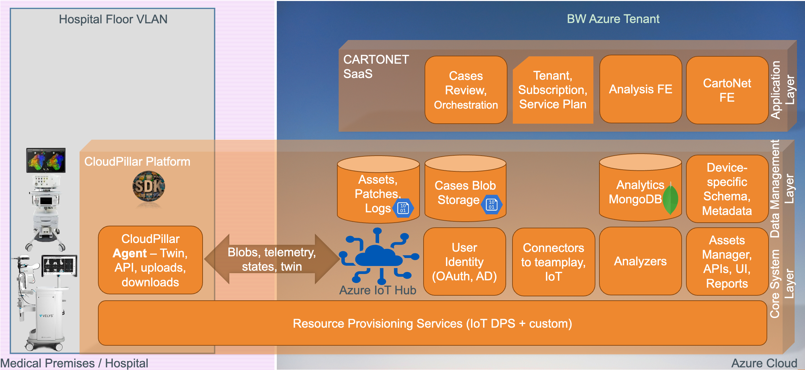

# Cloud Pillar for Medical Device exposure to the cloud: Enhancing Medical Equipment Security & Functionality

## Introduction
The Cloud Pillar for Cybersecurity is a revolutionary solution tailored for the healthcare sector. It's designed to bolster the capabilities of medical devices like CARTO, VELYS, and TRUDY by integrating advanced cloud functionalities. At its core, this system prioritizes cybersecurity, ensuring that each integration and functionality is designed with utmost security considerations.

## Key Features

- **Cloud Integration & Cybersecurity**: Seamlessly introduce medical devices to the cloud while ensuring data protection and security.
- **State Maintenance & Intelligent Operations**: An embedded state machine ensures synchronization with devices. The system intelligently pauses functionalities when a device is processing, ensuring zero disruptions.
- **Cybersecurity Updates**: Devices can download and optionally install cybersecurity updates. This feature ensures that medical equipment remains secure against evolving threats.
- **Advanced Communication**: Devices can upload state updates via Device Twin, share log files, and relay telemetry data for better system understanding.
- **Backend Capabilities**: Assets can be managed efficiently. Assign cybersecurity updates to groups of assets and analyze state, logs, and telemetry to generate intelligent events.
- **Future-Ready Integration**: In the pipeline is the ability for clinical research systems like CARTONET and CARTOSMART to access clinical data from devices supported by Cloud Pillar, especially in environments where SIEMENS Teamplay is absent.

## Technology & Integration
Built on the robust C# .Net Core 6-7 framework and integrating both AMQP and MQTT protocols, the Cloud Pillar for Cybersecurity is designed for optimal performance within the Azure IoT Hub. Emphasizing cybersecurity, every design decision is taken to ensure secure communications and operations.

## Benefits for the Healthcare Sector

1. **Enhanced Security**: Regular cybersecurity updates keep medical devices protected against emerging threats.
2. **Operational Efficiency**: Intelligent operations and state maintenance lead to smoother device operations.
3. **Data-Driven Insights**: Backend analysis of logs and telemetry data can lead to actionable insights for better device management.
4. **Future Compatibility**: As the digital transformation of healthcare continues, Cloud Pillar ensures that medical devices are adaptable, secure, and ready to integrate with future systems.

