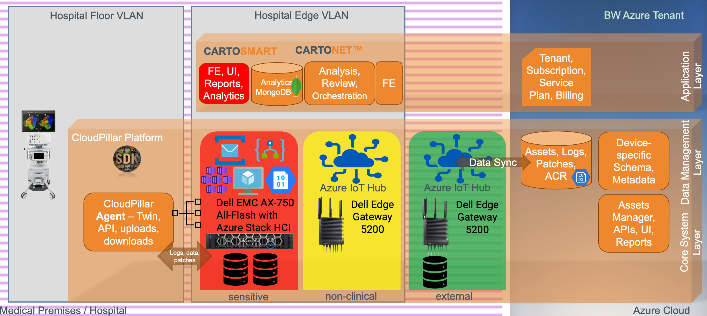

[[_TOC_]]

# 1. Introduction
## 1.1. Purpose of the Document

The purpose of this Top-Level Design (TLD) document is to provide a comprehensive architectural overview and design guideline for the CPC (Cloud Pillar for Cybersecurity) product. The document serves as a technical blueprint for all project stakeholders, including developers, project managers, system architects, and testers, outlining the product's key functionalities, technology stack, design principles, and compliance requirements.

CPC is an Agent and Backend system based on Azure IoT Hub, developed in C# .Net Core 6-7, leveraging AMQP and MQTT protocols. The product aims to enhance the capabilities of existing or upcoming medical devices by introducing cloud functionalities. It maintains a state machine in the Agent, which is present on every accompanying machine in hospitals and research institutions as a Windows Service or a Linux Daemon. The system pauses all operations when the medical device's software is processing a case, and resumes operation when the case processing is over.

Key functions of the product include downloading and installing security and functionality patches of the application, the McAffee antivirus, and (on the further stage) orchestrate the Windows / Linux OS service packs on the accompanying machine. The system also uploads system, application, and security logs to the cloud. The download, setup, and upload instructions are provided by the backend via the Device Twin's Desired section, and the progress of the execution and general device telemetry is reported via the Reported section.

This TLD document will further delve into the product's system design, data flows, security aspects, deployment strategies, compatibility considerations, and future roadmap. The document also aims to address all relevant ISO 27001 compliance considerations for the healthcare industry.


## 1.2. Document Conventions

This document adheres to the following conventions to ensure consistency and readability:

1. **Technical Terminology**: All technical terms, acronyms, and abbreviations are defined when first used. For instance, "CPC (CloudPillar for Cybersecurity)" is defined at the first mention, and thereafter referred to as "CPC". 

2. **Section Headers**: Each section of this document begins with a header. Main sections are marked with a single hash (#), sub-sections with two hashes (##), and so on. The headers provide a clear structure and enable easy navigation through the document.

3. **Code and Commands**: Any source code, commands, or scripts referenced in this document are presented in a monospaced font using the markdown code block convention, which is a line of text indented by four spaces or enclosed between triple backticks (\```). 

4. **Hyperlinks**: Hyperlinks are used for navigation within the document, and they're also used to reference external resources and documentation for further reading.

5. **Emphasis**: Key points, important notes, and warnings are emphasized using the markdown conventions for bold (enclosed in double asterisks or underscores) and italics (enclosed in single asterisks or underscores).

6. **ISO 27001 Compliance**: Any references to ISO 27001 compliance are marked with a double asterisk (**) and explained in detail in the respective section.

7. **Figures and Tables**: All figures and tables included in this document are numbered and have a caption. They are referred to in the text by their number.

Please adhere to these conventions when contributing to or modifying this document to maintain its clarity and consistency.


### 1.2.1. Table of Terms and Acronyms

The following table defines the key terms and acronyms used throughout this document:

| Term / Acronym | Definition |
| --- | --- |
| CPC | **C**loud**P**illar for **C**ybersecurity |
| CPD | **C**loud**P**illar for clinical **D**ata |
| CPE | **C**loud**P**illar for **E**dge |
| IoT | Internet of Things |
| TLD | Top-Level Design |
| AMQP | Advanced Message Queuing Protocol |
| MQTT | Message Queuing Telemetry Transport |
| OS | Operating System |
| API | Application Programming Interface |
| AKS | Azure Kubernetes Service |
| DPS | Device Provisioning Service |
| ISO 27001 | International Standard for Information Security Management Systems |
| ISMS | Information Security Management System |
| C2D | Refers to Cloud to Device messaging in Azure IoT |
| D2C | Refers to Device to Cloud messaging in Azure IoT |
| JSON| JavaScript Object Notation                  |
| CD  | Continuous Deployment/Delivery (in CI/CD)    |

Please refer to this table if you encounter any unfamiliar term or acronym in the document.


## 1.3. Intended Audience and Reading Suggestions

The primary audience for this document includes, but is not limited to:

- **System Architects and Engineers**: This group can use the document to understand the high-level design, architecture, technology stack, and integration points of the CPC product. They may find the sections detailing system overview, high-level system components, system design, and data flows particularly useful.

- **Developers**: This group can use the document to gain insights into the coding conventions, software environment, and system functionality. The sections on the technology stack, API design, and system design may be of particular interest.

- **Project Managers**: This group can use the document to understand the project scope, objectives, and roadmap. The sections on project scope and objectives, roadmap, and compliance considerations may be especially relevant.

- **Testers**: This group can use the document to understand the system's functionality and design in order to develop effective test plans. The sections on system design, data flows, and system functionality may be particularly informative.

- **Security and Compliance Officers**: This group can use the document to verify that the system design and processes adhere to ISO 27001 standards and other security best practices. The sections on security aspects, compliance considerations, and ISO 27001 compliance may be particularly beneficial.

This document is structured to be read sequentially, from the Introduction through to the Appendices. However, readers can also navigate to specific sections based on their particular interests or responsibilities. The table of contents provides an overview of the document structure to facilitate navigation.


## 1.4. Project Scope and Objectives

The project scope for the CloudPillar Cybersecurity (CPC) product primarily includes the development of an Agent and Backend system based on Azure IoT Hub, developed in C# .Net Core 6-7, and utilizing AMQP and MQTT protocols.

### Objectives

The key objectives of the CPC project include:

1. **Enable Cloud Capabilities for Existing Medical Devices**: The product is designed to provide cloud capabilities to existing medical devices. This functionality will be extended to Windows and Linux machines in hospitals and research institutions, improving their ability to handle cyber-related workflows.

2. **Maintain a State Machine in the Agent**: The Agent, present on each accompanying machine as a Windows Service or Linux Daemon, maintains a state machine, pausing all operations when the medical device's software is processing a case and resuming operations when the case processing is over.

3. **Manage Application and OS Patching**: The product will facilitate downloading and installing a series of patches for the application, McAffee antivirus, and Windows/Linux OS on the accompanying machine, streaming them to the Agent via AMQP and MQTT protocols.

4. **Upload System, Application, and Security Logs**: The system will also handle the uploading of system, application, and security logs to the cloud, streaming them via the same protocols.

5. **Provide Asset Management and Log Analysis Tools**: The CloudPillar Asset Manager Web app and a Backend API will help manage assets, assign updates, and analyze logs and telemetry.

### Out of Scope

The next stage of the product development, CP Patients Data (CPD), and the subsequent stage, CP Edge (an on-premises solution based on Azure IoT Edge), are not included within the current project scope. These stages will be addressed in future iterations of the project.

It is crucial to note that this project does not involve any changes or interventions in the medical devices themselves. The CPC solution is entirely focused on the accompanying systems and software. 

However, it is worth mentioning that the accompanied software, upon a software update or patch, may perform an implicit firmware update to the medical device itself. This process is governed by the applying patch; it is the responsibility of the patch creators to decide on, develop, and test this update to apply the firmware correctly.


# 2. System Overview
## 2.1. Product Description

The CloudPillar Cybersecurity (CPC) product is a comprehensive cloud-based solution designed to extend the capabilities of existing and future on-premises healthcare devices. It serves as a conduit for the digital transformation of these healthcare environments, focusing on enhancing cybersecurity workflows and bringing the power of cloud computing to the medical field.

The CPC product is composed of four main components:

1. **Agent**: The Agent is a crucial component of the CPC product, responsible for maintaining a state machine. It is present on every accompanying machine as a native Windows Service or a Linux Daemon (as a Docker container). The Agent pauses all operations when the medical device's software is processing a case and resumes operations when the case processing is over. It also manages the download and installation of patches for the application, endpoint protection solutions, and Windows/Linux OS on the accompanying machine.

2. **Backend**: The Backend system is developed based on Azure IoT Hub using C# .Net Core 6 or 7 and uses AMQP and MQTT protocols supported by Azure IoT Hub. It provides instructions for download, setup, and upload operations via the Device Twin's Desired section, and reports the progress of the execution and general device telemetry via the Reported section.

3. **CloudPillar Asset Manager Web App**: This web application is designed to manage assets and assign updates. It interfaces with the Backend to retrieve and display device data, including aggregated trends.

4. **Backend API**: The Backend API is the interface through which the Asset Manager communicates with the Backend system. It facilitates the transfer of instructions and data between the Backend and the Asset Manager, ensuring seamless coordination between all components of the system.

In addition to these components, the product incorporates advanced features for log analysis and telemetry. Logs are first stored in Blob storage and then picked up, parsed, and stored in Atlas MongoDB by one of the Backend microservices. GPU-based backend Analyzers (Python microservices) run machine learning on the logs in Mongo and produce analyzed data, which is also stored in Mongo.

The CPC product is designed to allow existing or future on-premises healthcare devices and accompanying hardware and software to rely on CPC as a platform to extend their functionality with the capabilities of cloud computing. This includes backend cloud healthcare analytics, monitoring, and asset management to deliver the data required to analyze device states and conditions.

Its robust design and versatile capabilities make it a valuable addition to the healthcare and research institutions, enhancing their cybersecurity infrastructure, and providing better control over their assets while leveraging the power and scalability of cloud computing.


## 2.2. Business Context

In the evolving landscape of healthcare technology, the integration of digital infrastructure with medical devices has become a necessity. Advanced medical equipment and healthcare software require continuous updates, patches, and cybersecurity measures to operate efficiently and securely. However, the traditional methods of manual patching, updating, and security management pose significant challenges in terms of scalability, speed, and efficiency.

The CloudPillar Cyber (CPC) product addresses these challenges by providing a comprehensive solution for maintaining and enhancing the software and cybersecurity aspects of healthcare devices. The integration of CPC allows healthcare institutions to extend their capabilities, streamline their operations, and enhance their services with the power of cloud computing.

From an internal **Johnson&Johnson perspective** as a global healthcare equipment provider, it can leverage the CPC to standardize and automate the update and patching process across its product line. This can significantly improve the operational efficiency, reduce the time-to-market for updates, and enhance the cybersecurity posture of its products. Furthermore, the predictive analytics and remote asset management capabilities of the CPC can provide valuable insights for product development, performance optimization, and proactive maintenance.

The demand for such a solution is evident in hospitals and research institutions that utilize a myriad of complex medical devices and accompanying software. By automating the patching, updating, and security management processes, these institutions can save valuable time, reduce operational costs, and minimize risks associated with cybersecurity threats.

Moreover, the CPC product aligns with the broader trend of digital transformation in the healthcare industry. By leveraging cloud technologies, the product allows healthcare providers to capitalize on the benefits of data analytics, machine learning, and remote asset management. The product's ability to provide essential device telemetry and log data further empowers healthcare providers to make data-driven decisions and enhance patient care.

With its robust functionalities and the ability to cater to the specific needs of the healthcare industry, the CPC product holds significant business value. It not only addresses immediate operational needs but also equips healthcare institutions for future advancements in medical technology.


## 2.3. Key Stakeholders

The development and successful deployment of the CPC product involves various stakeholders, each having unique responsibilities and interests in the project. Here are the key stakeholders involved:

1. **Project Management Team**: The Project Management Team oversees the entire project, coordinating resources, managing timelines, and ensuring that the project meets its objectives and stays within the budget.

2. **Development Team**: The Development Team is responsible for building the CPC product. This includes the Agent, Backend, CloudPillar Asset Manager Web App, and the Backend API.

3. **Quality Assurance Team**: The Quality Assurance Team tests the CPC product to ensure that it meets the required performance standards and fulfills its intended purpose. They are also responsible for identifying and rectifying any bugs or issues.

4. **Security Team**: The Security Team ensures that the CPC product adheres to the highest standards of cybersecurity. They evaluate the product's security measures and suggest enhancements when necessary.

5. **Operations and DevOps Team**: The Operations and DevOps Team facilitates the smooth deployment and operation of the CPC product. They collaborate with the development team to automate deployment processes, manage the product's infrastructure, and handle incident response.

6. **End Users**: End users include the healthcare professionals who use the medical devices and accompanying software that integrate with the CPC product. They rely on the product to automate patching, updates, and cybersecurity management.

7. **Medical Device Developers**, such as Biosense Carto® team, or DePuy Velys® team: As organizations that provide the medical devices and software, Johnson&Johnson Devices teams has a significant interest in the successful implementation of the CloudPillar product. They benefit from improved operational efficiency, enhanced cybersecurity, and the ability to leverage predictive analytics and remote asset management.

<!--8. **Medical Intelligence Application Developers**, such as Biosense CARTONET® team: As organizations that provide the medical software to analyze and enrich research and operations data acquired with J&J medical devices, Johnson&Johnson Intelligence Application teams has a significant interest in the successful implementation of the CloudPillar product as a platform for cloud-centric analysis & reviews of research case data. They benefit from improved operational efficiency, enhanced cybersecurity, and the ability to execute predictive analytics on case data, in reliable and secure fashion.-->

8. **Regulatory Bodies**: Regulatory bodies are responsible for ensuring that the CPC product complies with healthcare and cybersecurity regulations. Their role is to review and approve the product before it can be implemented in a healthcare setting.

9. **Customer Support Team**: The Customer Support Team provides assistance to end users, resolving any issues they may face while using the CPC product.

Each stakeholder plays a crucial role in the development, implementation, and continued success of the CPC product.


## 2.4. High-Level System Components

The CPC product consists of several high-level components, each designed to perform specific functions within the system. These components can be broadly categorized into two groups: the Agent and the Backend. 

### 2.4.1. Agent

The Agent is a critical component installed on each medical device's accompanying hardware. It operates as a Windows Service or a Linux Daemon (in a Docker container) and performs the following functions:

1. **State Machine Maintenance**: The Agent maintains a state machine, pausing all operations when the medical device's software is processing a case and continuing the operation when the case processing is over.

2. **Patch and Update Management**: The Agent downloads and installs patches and updates for the accompanying software and endpoint protection products on the accompanying machine. It also applies updates to the operating system of the machine. 

3. **Log and Telemetry Uploading**: The Agent uploads system, application, and security logs to the cloud. It also reports device telemetry via the Device Twin's Reported section.

4. **Local Interaction with Accompanying Software**: The Agent interacts locally with the accompanying software inside the machine boundaries via a localhost-restricted REST API. It also executes instructions (a.k.a. _recipes_) as per the Device Twin's Desired section and reports on the execution to the Reported section.

### 2.4.2. Backend

The Backend is the central component that manages and coordinates the activities of the Agents. It is developed in C# .Net Core 6-7 and is based on Azure IoT Hub. The backend includes:

1. **CloudPillar Asset Manager Web App**: A web application that allows backend users to manage assets and assign updates. It also enables the analysis of logs and telemetry.

2. **Backend API**: This supports the CloudPillar Asset Manager Web App by providing the necessary interfaces for interaction with the Backend.

3. **Backend Microservices**: These services handle various tasks such as listening to IoT events, streaming data to/from the Agent, picking logs from Blob storage, parsing them, and storing them in Atlas MongoDB. They also run machine-learning on the logs in Mongo and produce analyzed data.

4. **Device Provisioning Service**: This Azure-based service enables the secure and scalable registration of devices to the Backend.

The Backend and the Agent work together to enable the seamless integration of medical devices with cloud capabilities, thereby enhancing their functionality and allowing for more efficient and effective healthcare delivery.


## 3.1. Architecture Principles

The architecture for the CloudPillar for Cybersecurity of Connected Health Devices (CPC) is designed with the following key principles:

1. **Resilient Networking with Store-and-Forward Protocols**: Given the intermittent nature of network connections in hospital settings and firewalls blocking incoming connections, a store-and-forward protocol is used. This allows devices to store data locally and forward it to the cloud when the network connection is available, thereby ensuring data reliability and robustness.

2. **Secure and Dynamic Service Mesh with OSM**: Open Service Mesh (OSM) is used in Azure Kubernetes Service (AKS) to provide mutual Transport Layer Security (mTLS), handling and rotating certificates dynamically. This enables secure in-transit encryption and mutual authentication. OSM also supports advanced routing scenarios for blue-green deployments and canary distribution, and includes advanced tracing capabilities for comprehensive system insights.

3. **Separation of Concerns and Layered Microservice Design**: A clear separation of concerns is applied across the board, implementing a layered approach within the design of microservices (Infrastructure, Core, Application). This allows for independent evolution, simplified CI/CD pipeline, and enhances the system's modularity and maintainability.

4. **Model-View-Controller (MVC) Web App**: The web application adheres to the MVC design pattern, offering a clean separation between data, user interface, and control logic. This promotes a well-structured and manageable codebase.

5. **Data Integrity with Schema Validations**: All inter-service communication, data transmitted via IoT messaging, and the Device Twin undergo schema validation. This provides a robust mechanism to ensure data integrity and reliability.

6. **Efficient Device Management**: Advanced capabilities allow devices to be grouped and queried in the Asset Manager and the Azure IoT Portal by the actual state in the Device Twin. This offers efficient and intelligent device management.

7. **Optimized Data Access with Indexing**: Data in MongoDB is indexed to ensure efficient query processing, providing quicker access to data and improved system performance.

8. **Secure Device Authentication with Azure IoT DPS**: Azure IoT Device Provisioning Service (DPS) is used for device authentication, offering a secure and scalable method to register and provision devices to IoT Hub.

9. **Comprehensive Endpoint Protection**: Endpoint protection solutions are integrated, adding an additional layer of security for the on-premises devices and ensuring robust threat mitigation.

10. **Cloud-First Design and Best Practices Alignment**: The architecture aligns with industry best practices for cloud-based telehealth systems, emphasizing scalability, team autonomy, flexibility, latency optimization, caching, coordinated deployments, effective database management, and comprehensive monitoring.

> 10.1 ***Scalability and Autonomy***: The architecture should be designed in a way to benefit from the scalability of the cloud services running in the backend. Each team overseeing different functional domains should have autonomy and be able to innovate at its own pace. This is achieved through independent codebases for the services that span across teams and streamlined CI/CD pipelines for the entire solution​.
> 10.2 ***Components and Services***: The architecture should consist of components that cater to different functionalities like user and device-related data storage, hosting the application business logic, notifying patients of incoming content, scheduling tasks, and troubleshooting purposes. Each of these components contributes to the overall functionality of the system and enhances the ability to troubleshoot the solution​.
> 10.3 ***Alternatives and Flexibility***: The architecture should be flexible enough to incorporate alternative solutions when needed. For instance, instead of using Azure Kubernetes Service for hosting the application logic, other services like Azure IoT Edge will be considered, when applicable​.
> 10.4 ***Latency Optimization and Caching***: It is recommended to use a traffic manager in front of different clusters to optimize for latency between regions and as a fallback mechanism should the clusters become unavailable. Delivering static web files globally using a content delivery network (CDN) can improve speed through caching​​.
> 10.5 ***Coordination of Deployments***: It is important to coordinate deployments across the cloud-based backend and the frontend. This can be achieved using the concept of a feature flag​​.
> 10.6 ***Database Management and Monitoring***: The idea of having each functional domain dealt with using a specific microservice can be extended to database management. It is recommended to split the database into several smaller databases to enable the principle isolation and autonomy of the flow related to each microservice. Monitoring each of the tiers is crucial and each monitoring facet should be federated into a single bucket in the cloud. This enables the correlation of all these logs and telemetry data points to ensure holistic insights across components and layers​​.
> 10.7 ***Sizing and Scaling***: Optimizing the configuration of the Azure Kubernetes clusters to match the scale requirements that fluctuate with the time of the day or regional patterns is crucial. Offloading read workloads by using Read Replicas in the Atlas MongoDB can be considered to handle the time-related data coming from the medical devices efficiently​​. 
_These best practices reinforce the architecture principles mentioned above, such as the intermittent nature of hospital networking connections, the use of store-and-forward protocols, the benefits of OSM in AKS, the separation of concerns across the board, the layered approach to the inner design of microservices, the use of MVC in the web app, schema validations of all inter-service communication, and the advanced capabilities allowing to group and query devices in the Asset Manager and the Azure IoT Portal by actual state in the Device Twin_.

The architecture also aligns with these best practices by relying on Azure IoT DPS for device authentication, using OSM for mTLS, rotating certificates dynamically to achieve mutual authentication and in-transit encryption, supporting advanced routing scenarios for BG deployments and canary distribution, and adding advanced tracing capabilities.

The architecture adheres to these principles to deliver a robust, flexible, and secure solution for the CPC, which are all crucial elements in healthcare IoT systems.


## 3.2. Architecture Diagram
###Kubernetes Terms

|Type of controller|Abbreviation|
|--|--|
| [Replication Controller](https://kubernetes.io/docs/concepts/workloads/controllers/replicationcontroller/) | RC |
| [Replica Set](https://kubernetes.io/docs/concepts/workloads/controllers/replicaset/) | RS |
| [Deployment](https://kubernetes.io/docs/concepts/workloads/controllers/deployment/) | D |
| [DaemonSet](https://kubernetes.io/docs/concepts/workloads/controllers/daemonset/) | DS |
| [StatefulSet](https://kubernetes.io/docs/concepts/workloads/controllers/statefulset/) | SS |
| [Job](https://kubernetes.io/docs/concepts/workloads/controllers/jobs-run-to-completion/) | J |
| [Cron Job](https://kubernetes.io/docs/concepts/workloads/controllers/cron-jobs/) | CJ |


::: mermaid
flowchart LR
  %%{init: {'themeVariables': { 'fontSize': '18px', 'fontFamily': 'Inter'}}}%%
  classDef transparentSubgraph fill:transparent,stroke:#333,stroke-width:2px;
  classDef invisibleNode fill:transparent,stroke:transparent;

  subgraph Device_Hosting_Machine["Device Accompanying Machine - Windows Pro, Enterprise or Server, or Linux machines"]
    InvisibleNode1[ ]:::invisibleNode
    subgraph Local_Service_Daemon["Docker Container or Windows Service"]
      IoT_Agent[IoT Agent]
      DotNetCore[.Net Core Runtime]
    end

    subgraph Hosting_Application["Accompanying App - Carto, Velys"]
      SDK
    end

  end
  subgraph Azure_Availability_Zone["&nbsp&nbsp&nbsp&nbsp&nbsp&nbsp&nbsp&nbsp&nbsp&nbsp&nbsp&nbsp&nbsp&nbsp&nbsp&nbsp&nbsp&nbsp&nbsp&nbsp&nbsp&nbsp&nbsp&nbsp&nbsp&nbsp&nbsp&nbsp&nbsp&nbsp&nbsp&nbsp&nbsp&nbsp&nbsp&nbsp&nbsp&nbsp&nbsp&nbsp&nbsp&nbsp&nbsp&nbsp&nbsp&nbsp&nbsp&nbsp&nbsp&nbsp&nbsp&nbsp&nbsp&nbsp&nbsp&nbsp&nbsp&nbsp&nbsp&nbsp&nbsp&nbsp&nbsp&nbsp&nbsp&nbsp&nbsp&nbsp&nbsp&nbsp&nbsp&nbsp&nbsp&nbsp&nbsp&nbsp&nbsp&nbsp&nbsp&nbsp&nbsp&nbsp&nbsp&nbsp&nbsp&nbsp&nbsp&nbsp&nbsp&nbsp&nbsp&nbsp&nbsp&nbsp&nbsp&nbsp&nbsp&nbsp&nbsp&nbsp&nbsp&nbsp&nbsp&nbsp&nbsp&nbsp&nbsp&nbsp&nbsp&nbsp&nbsp&nbsp&nbsp&nbsp&nbsp&nbsp&nbsp&nbsp&nbsp&nbsp&nbsp&nbsp&nbsp&nbsp&nbsp&nbsp&nbsp&nbsp&nbsp&nbsp&nbsp&nbsp&nbsp&nbsp&nbsp&nbsp&nbsp&nbsp&nbsp&nbsp&nbsp&nbsp&nbsp&nbsp&nbsp&nbsp&nbsp&nbsp&nbsp&nbsp&nbsp&nbsp&nbsp&nbsp&nbsp&nbsp&nbsp&nbsp&nbsp&nbsp&nbsp&nbsp&nbsp&nbsp&nbsp&nbsp&nbsp&nbsp&nbsp&nbsp&nbsp&nbsp&nbsp&nbsp&nbsp&nbsp&nbsp&nbsp&nbsp&nbsp&nbsp&nbsp&nbsp&nbsp&nbsp&nbsp&nbsp&nbsp&nbsp&nbsp&nbsp&nbsp&nbsp&nbsp&nbsp&nbsp&nbsp&nbsp&nbsp&nbsp&nbsp&nbsp&nbsp&nbsp&nbsp&nbsp&nbsp&nbsp&nbsp&nbsp&nbsp&nbsp&nbsp&nbsp&nbsp&nbsp&nbsp&nbsp&nbsp&nbsp&nbsp&nbsp&nbsp&nbsp&nbsp&nbsp&nbsp&nbsp&nbsp&nbsp&nbsp&nbsp&nbsp&nbsp&nbsp&nbsp&nbsp&nbsp&nbsp&nbsp&nbsp&nbsp&nbsp&nbsp&nbsp&nbsp&nbsp&nbsp&nbsp&nbsp&nbsp&nbsp&nbsp&nbsp&nbsp&nbsp&nbsp&nbsp&nbsp&nbsp&nbsp&nbsp&nbsp&nbsp&nbsp&nbsp&nbsp&nbsp&nbsp&nbsp&nbsp&nbsp&nbsp&nbsp&nbsp&nbsp&nbsp&nbsp&nbsp&nbsp&nbsp&nbsp&nbsp&nbsp&nbsp&nbsp&nbsp&nbsp&nbsp&nbsp&nbsp&nbsp&nbsp&nbsp&nbsp&nbsp&nbsp&nbsp&nbsp&nbsp&nbsp&nbsp&nbsp&nbsp&nbsp&nbsp&nbsp&nbsp&nbsp&nbsp&nbsp&nbsp&nbsp&nbsp&nbsp&nbsp&nbsp&nbsp&nbsp&nbsp&nbsp&nbsp&nbsp&nbsp&nbsp&nbsp&nbsp&nbsp&nbsp&nbspAzure Region"]
    subgraph Azure_Subscription[Azure Tenant Subscription]
      InvisibleNode3[ ]:::invisibleNode
      subgraph Azure_IoT_Hub[Azure IoT Hub]
        Partition[Partition #N]
        IoT_Device[IoT Device]
        subgraph IoT_DeviceTwin[Azure IoT Device Twin]
          IoTDeviceTwinReported[Reported Props]
          IoTDeviceTwinDesired[Desired Props]
        end
      end

      subgraph AKS_CPU_Cluster[AKS Backend Cluster - CPU]
        BlobStreamer[blobstreamer D]
        IoTListener[iotlistener SS]
        TwinListener[twinlistener D]
        BEAPI[beapi D]
        MongoWriter[mongowriter D]
        KeyHolder[keyholder D]
      end
      subgraph AKS_Front_Cluster[AKS Frontend Cluster - CPU]
        BEApp[bewebui D]
      end

      subgraph Azure_Storage_Account[Storage Account]
        Binblobs[Patch Blobs]
        Logblobs[Uploaded Blobs]
        Storage_Container[(Storage Container)]
      end

      subgraph Azure_KeyVault[Azure KeyVault]
        KeyVault_Secret[(Secret)]
      end

    end

    subgraph Atlas_Tennant_Account[Atlas Tenant Account]
      Version_Logs_Telemetry[Versions, Logs, Telemetry]
      MongoDB_Atlas[(MongoDB)]
      MongoDB_GraphQL([Managed GraphQL app])
      MongoDB_ChartsViews[[BI Charts Views]]
    end

    subgraph Azure_Analyzis_Subscription["Analyzis Subscription"]
        subgraph AKS_GPU_Cluster[AKS Analyzer Cluster - GPU]
            Analyzer[analyzer D]
        end
    end
  end
  IoT_Agent --> |Change prop| IoTDeviceTwinReported
  IoTDeviceTwinReported --> |API Twin Reported| TwinListener
  Analyzer --> |API read, write| Version_Logs_Telemetry

  Azure_Availability_Zone:::transparentSubgraph
  SDK -->|get_state| IoT_Agent
  SDK -->|commands| IoT_Agent
  IoT_Agent --o |subscribe for desired props| IoTDeviceTwinDesired
  IoT_Agent --> Partition
  IoT_Agent --o |pull C2D messages| IoT_Device
  Partition --> |deliver D2C messages| IoTListener
  IoTListener --> |SvcBus WriteLogs| MongoWriter
  IoTListener --> |"REST StreamRange(file, range)"| BlobStreamer
  IoTListener --> |REST SignRecipe| KeyHolder
  BlobStreamer --> |1. API ReadBlockFile| Binblobs
  BlobStreamer --> |2. push C2D messages x N| IoT_Device
  BlobStreamer --> |3. push C2D VerifyRangeCRC| IoT_Device
  BlobStreamer --> |4. API WriteBlockFile| Logblobs
  TwinListener --> |SvcBus WriteTelemetry| MongoWriter
  BEAPI --> |REST SignBlob| KeyHolder
  BEAPI --> |REST SignRecipe| KeyHolder
  BEAPI --> |API Update Desired Props| IoTDeviceTwinDesired
  BEApp --> |REST BaseVersion, ServicePack, Recipe, Execution| BEAPI
  MongoWriter --> |store logs| Version_Logs_Telemetry
  KeyHolder --> |API ReadSecret| KeyVault_Secret
  KeyHolder --> |API ReadBlockFile| Binblobs
  InvisibleNode1
  InvisibleNode3
:::

The J&J IoT Device **SDK** resides in the boundaries of the **hosting application**. It communicates to the IoT **Agent**, residing at the same Windows or Linux **machine**, as an always-on local service/daemon, deployed as a Docker container, or a Windows Service; the **SDK** sends Commands to the **Agent**, and the latter responds with state_changed notifications, according to the state transitions described [above](#state-transitions) (the notifications are delivered to the **SDK** via HTTP requests / polling).

The **Agent** communicates with **Azure IoT Hub** in a single-tenant, dedicated environment, sending D2C and accepting C2D messages from the backed. Behind the IoT Hub, there's a k8s **backend app**, listening for D2C messages in a particular **partition** #N, and sending firmware updates via C2D messages, streaming them as chunks. The **Agent** also sends logs to the backend **D2CListener** microservice. Then, all version, logs and telemetry is stored in **MongoDB Atlas**. 

Firmware / Patch blobs are kept in Azure **storage container**.

**Log Collection Backend 1** is one or more of the following:
* Azure Automation
* Intune
* Cloud Endpoint Management
* Azure IoT Device Update


## 3.3. Component Descriptions
### 3.3.1. Azure IoT Hub
Azure IoT Hub is a managed service, hosted in the cloud, that acts as a central message hub for bi-directional communication between your IoT application and the devices it manages. In the context of this system, it plays a crucial role in facilitating communication and device management.

Azure IoT Hub supports communications both from the device to the cloud and from the cloud to the device. It also supports multiple messaging patterns such as device-to-cloud telemetry, file upload from devices, and request-reply methods to control your devices from the cloud. In our application, the IoT Hub is responsible for managing the communication between the SDK, IoT Agent, and IoT devices.

IoT Hub monitoring features enable you to maintain the health of your solution by tracking events such as device creation, device failures, and device connections.

Additionally, Azure IoT Hub integrates with other services like Azure Event Grid and Azure Logic Apps, which can react to these events and take multiple custom actions, further driving the efficiency of your IoT application.

### 3.3.2. Agent
#### 3.3.2.1. SDK
The Software Development Kit (SDK) in the CPC system is a collection of software tools and libraries that are used for creating applications for a specific device or software package. However, it's important to note that the SDK is an optional component in the architecture.

In the context of this application, the SDK is responsible for interfacing with the IoT Agent to perform actions like getting the state of a device or sending commands to it. It provides a way to interact with the CloudPillar's functionality without having to deal with the low-level complexities of communication.

Alternatively, the Accompanying Application (AA) can choose to bypass the SDK and make API calls directly to the local API that the Agent exposes. This provides flexibility in how the AA interacts with the devices and allows for a more direct method of communication if preferred or required.

The SDK simplifies the process of integrating the devices into our system by providing pre-built functions that developers can use to communicate with the IoT Agent, and indirectly, the devices. This allows the developers to focus on the functionality of the application, leaving the complexities of device communication to the SDK.

In order to accommodate both interaction options, all project documentation shall provide comprehensive guidelines for interacting with the devices both via the SDK and directly via the API. This ensures that developers have all the necessary information to decide the best approach for their specific requirements.

Regardless of the interaction method chosen, it is crucial that the SDK and API are robust and reliable, as they form the primary interface for interacting with the devices. Any issues or bugs in these components could significantly affect the operation of the devices and the overall functionality of the application.

#### 3.3.2.2. IoT Agent
The IoT Agent serves as a pivotal component of the system by managing communication between the device and cloud-based backend services via the Azure IoT Hub. By operating on each device, the IoT Agent is responsible for a multitude of critical tasks that ensure the system operates smoothly and securely.

First and foremost, the IoT Agent facilitates communication with the device's SDK. This process involves both pulling data from and sending commands to the device. The Agent thus acts as a bridge between the device's low-level operations and the high-level functionalities provided by the backend services.

The IoT Agent plays a crucial role in managing the device's twin properties stored in the Azure IoT Hub. It subscribes to changes in the desired properties of the device twin and updates the reported properties as necessary. This system allows for efficient synchronization of the device state between the device itself and the cloud.

However, it's essential to note that the IoT Agent strictly enforces schema validation in this process. Any operation that attempts to modify the reported properties of the device twin must conform to the defined schema. This schema enforcement ensures data integrity and consistency across the system.

Similarly, all messages sent from the Agent to the backend and vice versa are subject to schema validation. This mechanism guarantees that all messages conform to the expected format, ensuring data consistency and reducing the possibility of errors due to malformed or unexpected data.

The IoT Agent's responsibilities also include the delivery of Device-to-Cloud (D2C) messages. It forwards these messages to the Azure IoT Hub, which subsequently routes them to the appropriate partition for processing and potential storage in the MongoDB database.

The IoT Agent also pulls Cloud-to-Device (C2D) messages from the IoT Device in Azure. This process enables the system to push updates and instructions from the cloud to the device.

In the event of binary file streaming, the IoT Agent collaborates with the Blob Streamer through the Azure IoT Hub. This process includes a series of steps, beginning with initiating a ReadBlockFile API call to the Patch blobs in Azure, followed by pushing C2D messages to the IoT Device and verifying the range CRC.

In summary, the IoT Agent serves as a critical bridge in the system, mediating communication between devices and the cloud-based backend services. Its efficiency and reliability significantly impact the functionality and reliability of the entire system. By enforcing schema validation, the IoT Agent ensures data consistency and integrity, leading to more robust and error-free operations.

#### 3.3.2.3. Partition
In the context of this architecture, the term "Partition" refers to a component that is integral to the functioning of the Azure IoT Hub. The partition is a recipient of the Device-to-Cloud (D2C) messages delivered by the IoT Agent. These messages contain valuable data about the state of the device and other important information that needs to be processed, stored, or utilized by other components in the system.

A key aspect of the Azure IoT Hub service is its ability to handle large volumes of data that can be generated by numerous devices. This scalability is achieved through the use of partitions. When a device sends a D2C message to the IoT Hub, the message is automatically assigned to one of the available partitions. Each partition operates independently, which allows the IoT Hub to process multiple messages in parallel, thus providing a highly scalable system that can handle large data volumes efficiently.

The partition not only receives the D2C messages but also forwards them to the IoT Listener. The IoT Listener then further processes these messages, which can include logging telemetry data, streaming binary files, or managing secret keys, among other tasks.

In summary, the partition plays a crucial role in the system by managing the flow of D2C messages from the IoT Agent to the IoT Listener. Its role is pivotal to maintaining the system's scalability, efficiency, and the smooth flow of data from devices to the cloud-based backend services.

### 3.3.3. Backend
#### 3.3.3.1. IoT Listener
The IoT Listener, a Stateful Set (SS) in the Kubernetes environment, is a critical component in the architecture which handles the processing of Device-to-Cloud (D2C) messages delivered by the Partition. Each instance of the IoT Listener in the SS is assigned to a specific IoT Hub partition by corresponding the pod number to the partition number. This approach ensures a dedicated and reliable processing of messages for each partition.

The IoT Listener is configured to perform different tasks based on the nature of the messages it receives. Its key responsibilities include writing logs, managing binary file streaming, and handling secret keys.

When dealing with telemetry data, the IoT Listener communicates with the MongoWriter via Azure Service Bus. This approach is chosen due to the asynchronous and highly reliable nature of Service Bus messaging, which is essential for handling potentially large volumes of telemetry data. The IoT Listener captures data from the D2C messages, processes it as required, and sends it to the MongoWriter through Service Bus for storage in the MongoDB.

For binary file streaming operations, the IoT Listener interacts with the BlobStreamer using REST API requests. The use of REST API allows for more direct and immediate communication, which is required for initiating the streaming of a specific range of a binary file. Upon receiving the request, the BlobStreamer interacts with the Patch blobs component and the IoT Device to read the required block file and push necessary Cloud-to-Device (C2D) messages respectively.

The IoT Listener also employs REST API communication for secret key management. When a secret key needs to be signed, the IoT Listener sends a REST API request to the KeyHolder. The KeyHolder then interacts with the KeyVault_Secret and Patch blobs to perform the necessary operations.

In summary, the IoT Listener is a stateful Kubernetes service responsible for managing the processing of D2C messages and coordinating various tasks related to telemetry data logging, binary file streaming, and secret key management. It uses both Azure Service Bus and REST API communications to effectively coordinate these operations with other system components.

#### 3.3.3.2. BlobStreamer
The BlobStreamer is a Kubernetes Deployment that handles the downloading and uploading of binary files between the system and the IoT Device. It communicates with the binary files stored in Azure Blob Storage and the IoT Device using REST APIs and Azure IoT Hub's Cloud-to-Device (C2D) and Device-to-Cloud (D2C) messaging mechanisms, respectively.

During the downloading process, upon receiving a request for a specific range of a binary file from the IoT Listener, the BlobStreamer makes a REST API call to Azure Storage to read the required block of the binary file. It then sends a series of C2D messages to the IoT Device, each carrying a portion of the binary file. This series of messages streams the entire requested range of the binary file to the IoT Device. After the streaming of the binary file data is completed, the BlobStreamer sends a C2D message to the IoT Device to trigger the verification of the Range CRC, ensuring the integrity of the streamed data.

The uploading process involves the IoT Listener receiving D2C messages from the IoT Device that contain chunks of the uploaded file. The IoT Listener then translates these D2C messages into REST calls to the BlobStreamer. The BlobStreamer takes these chunks and writes them directly into their respective positions in the file at Azure Storage, using Azure SDK, which implies REST API calls.

The BlobStreamer's operations, both downloading and uploading, are streamlined and efficient due to the use of REST API for direct communication with Azure Storage and the IoT Device. This design ensures a reliable process for streaming binary file data and verifying its integrity, making the BlobStreamer a key component in the system's architecture.

#### 3.3.3.3. TwinListener
The TwinListener is a Kubernetes Deployment that serves as the communication link between the backend system and the IoT Device Twin. It specifically monitors changes to the reported properties in the Device Twin.

When a reported property in the Device Twin changes, the TwinListener captures this event through a subscription to the Azure IoT Hub. Upon receiving the change notification, the TwinListener sends a message through ServiceBus to the MongoWriter component. This message instructs the MongoWriter to update the corresponding records in the MongoDB database. This ensures that the backend system maintains an up-to-date representation of the IoT Device state.

It's important to note that the TwinListener is solely responsible for monitoring and updating the reported properties of the IoT Device Twin. It does not handle the updates to desired properties - those are handled differently in the system.

The TwinListener is a vital component in the system, ensuring real-time synchronization of device states between the IoT Device and the backend. Its role as the intermediary between the backend and the Device Twin, combined with the use of ServiceBus for communication, ensures efficient and accurate state synchronization.

### 3.3.4. Backend API (BEAPI)
The Backend API (BEAPI) is a Kubernetes Deployment that provides the primary interface for the Backend Application (BEApp), also known as the Asset Manager, to interact with the backend system, offering a set of RESTful endpoints for various functionalities.

The BEAPI's main duties are to process requests from the BEApp and to manage communication with various components of the system. It is in charge of the following key operations:

1. **Signing Blob and Recipe**: When the BEApp needs to upload a file or establish a recipe (a set of instructions for a device), the BEAPI communicates with the KeyHolder component. It sends a REST call to the KeyHolder with the necessary data, and the KeyHolder responds with the signature, which is returned to the BEApp.
2. **Updating Desired Properties of the IoT Device Twin**: When the BEApp sends a request to change the desired properties of a device twin, the BEAPI makes a direct API call to the IoT Device Twin to update the desired properties.
3. **Handling Requests from the BEApp**: The BEAPI processes requests coming from the BEApp, which could be related to retrieving the base version, service pack, recipe, or execution data. The BEAPI performs the necessary operations to fulfill these requests and sends back the responses to the BEApp.

Note that the BEAPI does not communicate directly with the IoT Listener or BlobStreamer; instead, it communicates with these components indirectly through the IoT Hub and ServiceBus. The BEAPI's main form of accepted communication is REST API calls, which offer a straightforward and efficient method for interaction between components.

The Backend API serves as a key orchestrator in the system, coordinating communication between the BEApp and various components, processing requests, and ensuring successful execution of operations.

### 3.3.5. Backend Asset Manager Application (BEApp)
The Backend Application (BEApp), also known as the Asset Manager, is a Kubernetes Deployment that serves as the main user-facing interface for the system. It is built using Vue.js, a progressive JavaScript framework for building user interfaces. The BEApp generates "dynamic" web content based on the state of the system, user interactions, and data retrieved from the Backend API (BEAPI).

The primary responsibilities of the BEApp include:

1. **Generating Dynamic Web Content**: Leveraging Vue.js, the BEApp creates responsive, component-based user interfaces. It makes RESTful API calls to the BEAPI to retrieve various types of system data, including base version, service pack, recipe, and execution status. This data is then used to update the Vue.js components, creating a dynamic and interactive web experience for the users.
2. **Managing System Configuration Updates**: The BEApp facilitates updates to system configurations through the user interface. When a user makes changes to the configuration via the Vue.js interface, the BEApp processes these changes and sends the updated configuration data to the BEAPI via RESTful API calls. The BEAPI then propagates these changes to the rest of the system as required.
3. **Interfacing with Azure CDN for Static Content Delivery**: While the BEApp is responsible for generating dynamic web content, static content, such as CSS stylesheets, JavaScript libraries, raster images, and static vector graphics, are served from the Azure Content Delivery Network (CDN). This approach allows for a [separation of concerns](), where the BEApp focuses on generating dynamic, reactive web content, while the Azure CDN efficiently delivers static content. This setup not only enhances the performance of the web interface but also improves its scalability.

In essence, the BEApp, powered by Vue.js, serves as a vital link between the users and the system backend. It orchestrates user interactions with the system through a dynamic, responsive web interface, while also coordinating with the BEAPI and Azure CDN to ensure a smooth, efficient web experience.

### 3.3.6. Mongo Writer
MongoWriter is a crucial backend service in our architecture, deployed as a Kubernetes deployment, responsible for reliably and sequentially writing telemetry and logs data to MongoDB.

The data that MongoWriter processes comes from several sources, including IoTListener and TwinListener, each providing telemetry data from IoT devices and system operation logs respectively. All these data sources communicate with MongoWriter via Azure Service Bus, which allows for decoupling of data generation and data writing operations. This ensures an asynchronous, reliable data transfer and plays a critical role in data preservation in case of any temporary issues or database downtime.

The sequential writing of data is of high importance in our system, as it helps maintain the correct order of operations and events. This is particularly crucial for the system's logs, where the sequence of events can aid in troubleshooting and system analysis. MongoWriter is designed to respect this sequential order of data when performing write operations.

MongoWriter writes to the Version_Logs_Telemetry MongoDB collections, aptly named as it stores version information, system logs, and telemetry data from IoT devices. To interact with MongoDB, MongoWriter utilizes the MongoDB .NET driver, which provides robust, native functionalities to connect and perform operations on MongoDB databases.

When designing a system with high volumes of data like ours, handling peak times and preventing overloads is critical. Therefore, an autoscaling strategy for MongoWriter should be considered. Kubernetes supports autoscaling of deployments based on CPU and memory usage. However, considering MongoWriter's workload, a custom metric such as the length of the Azure Service Bus queue could be a more accurate indicator of load. Kubernetes allows autoscaling based on custom metrics, which can be utilized for this purpose.

In terms of implementation, MongoWriter should incorporate efficient error handling and retry mechanisms to deal with any potential issues during write operations. This includes handling common MongoDB exceptions, network issues, and dealing with temporary unavailability of the database.

In conclusion, MongoWriter plays a pivotal role in the system by ensuring all relevant data is reliably and sequentially stored in the database, making it available for further processing, analysis, and visualization.
### 3.3.7. Blob Storage
Azure Blob Storage is a scalable, cost-effective object storage for unstructured data. Blob Storage can handle all the unstructured data, scaling up or down as our needs change. 

#### 3.3.7.1. Patch blobs
Patch blobs represents a Blob Storage containers that holds binary files. Patch blobs files could be firmware files, patches, updates, or any other type of binary data that needs to be stored and retrieved.

The interaction with Azure Blob Storage is done through the Azure Storage client libraries for .NET, which offers a convenient interface for making calls to Azure Storage​.

Patch blobs are used in the BlobStreamer component, where it serves as the source for binary files that are requested by IoT devices. When a file or a specific range of a file is requested by an IoT device, BlobStreamer reads the file from the Patch blobs container and streams it to the requesting device.

For security and integrity verification, the binary files are signed using the KeyHolder component before they are delivered to the IoT devices. This ensures that the files are not tampered with during the transfer and that they originate from a trusted source.

For efficient management and operations, the Azure Storage SDKs are used. They provide functionalities such as uploading and downloading blob data, managing blob metadata, and implementing advanced blob scenarios such as copying blobs and managing blob leases​.

### 3.3.8. KeyHolder
KeyHolder, deployed as a Kubernetes Deployment, is an essential component in our architecture that deals with the secure storage, retrieval, and usage of keys, secrets, and certificates in the system.

KeyHolder communicates with Azure Key Vault, a cloud service that provides secure storage for application secrets, via the Azure Key Vault REST API. It uses Azure Key Vault's ReadSecret API to fetch secrets as needed by other components in the system. It also interacts with the Patch Blob storage, using the ReadBlockFile API to fetch binary files, likely including encrypted data or keys. This interaction pattern underlines the critical role of KeyHolder in managing secure access to sensitive data within our system.

The KeyHolder service is called upon by other components in the system, such as BEAPI and IoTListener, for signing operations. For instance, BEAPI makes SignBlob and SignRecipe REST calls to KeyHolder, which KeyHolder then processes using the appropriate keys or secrets fetched from Azure Key Vault. Similarly, IoTListener calls KeyHolder with a SignRecipe REST request, demonstrating KeyHolder's role in ensuring the integrity and authenticity of data and commands in our system.

KeyHolder's interactions with Azure Key Vault should follow the principle of least privilege, i.e., it should only request and have access to the keys, secrets, or certificates that are necessary for the operation it is currently handling. This limits the potential impact of a security compromise.

Furthermore, KeyHolder should implement robust error handling and logging to manage potential issues during its interactions with Azure Key Vault and the Blob Storage service. It should also consider implementing caching for frequently accessed secrets to improve performance.

Auto-scaling of the KeyHolder service should be considered, especially during peak loads. The auto-scaling strategy can be based on CPU usage, memory usage, or custom metrics, as appropriate for the specific requirements of KeyHolder.

In conclusion, KeyHolder is a vital service in our system, handling the secure management and usage of secrets, keys, and certificates, and thus playing a critical role in maintaining the overall security posture of our architecture.

<!--### 3.3.9. Analytics Writer
The Log Analytics Writer is a Kubernetes Deployment designed to listen to a pair of Azure Service Bus subscriptions tied to two topics. 

The Analytics Writer pushes data to the Intune log collection, which has been configured for consumption by the Azure Log Analysis Workspace.

Intune Log Collection
Intune, Microsoft's cloud-based device management service, provides the capability to collect logs from managed devices and applications. These logs provide valuable information about device and app statuses, including details about updates, system health, compliance, and more.

In the context of our telehealth solution, Intune's log collection capabilities are used to keep track of the health and status of various components of the system, such as the IoT devices and backend services. This can help with troubleshooting, monitoring, and optimizing the telehealth solution.

Azure Log Analytics Workspace
The Azure Log Analytics Workspace is a tool in the Azure Monitor suite that allows you to collect, store, and analyze log data from various sources. It provides advanced analytics capabilities through a query language and log-based machine learning.

For our telehealth solution, the Azure Log Analytics Workspace is used to analyze the log data collected by Intune. This can provide insights about system behavior, identify trends or anomalies, and aid in troubleshooting.

The Log Analytics Writer, by sending data to the Azure Log Analytics Workspace, enables the system to leverage these powerful analysis capabilities to enhance the overall management and monitoring of the telehealth solution.

Please note that the Azure Log Analytics Workspace is built to handle large volumes of data and can be scaled according to the needs of your application. It also integrates well with other Azure services and third-party applications, providing a comprehensive and flexible tool for log data management and analysis.

Remember, the Log Analytics Writer as a Kubernetes Deployment ensures high availability and failover capabilities, leveraging the robust features of the Kubernetes platform.
### 3.3.9. MongoDB
#### 3.3.9.1. Versions, Logs, Telemetry collections
The "Versions", "Logs", and "Telemetry" collections in MongoDB Atlas are essential components of our architecture that store and manage crucial data about the system's operation and state.

**Versions Collection**: This collection is used to keep track of the versions of different components or aspects of our system. By maintaining a historical record of versions, we can understand the system's evolution over time, manage updates, handle backward compatibility, and assist in debugging and troubleshooting.

**Logs Collection**: The Logs collection is an essential part of our system's observability infrastructure. It collects log data from various components of the system. The logs can include information about system operations, errors, performance metrics, and more. This collection is vital for monitoring system health, troubleshooting issues, and understanding system behavior. Given the critical nature of log data, it is recommended to use appropriate indexing for efficient querying and to consider retention policies to manage the size of the collection.

**Telemetry Collection**: This collection stores telemetry data from various parts of the system, including the IoT devices and backend components. Telemetry data can provide real-time insights into system performance, usage patterns, and operational issues. This data can be used for real-time monitoring, alerting, system optimization, and predictive maintenance.

These collections in MongoDB Atlas are accessed by various components of our system. The MongoWriter backend service writes data to these collections, while other services may read from them as needed for analysis, monitoring, or other purposes. The communication with MongoDB Atlas should be secured using appropriate authentication and encryption methods.

These collections should be designed with scalability in mind, as the amount of version, log, and telemetry data can grow significantly over time. MongoDB Atlas's built-in scalability features, such as sharding and replication, can be used to handle this growth.

#### 3.3.9.2. Atlas GraphQL app
(Content here)

#### 3.3.9.3. MongoDB Charts
(Content here)

#### 3.3.9.4. Atlas Dashboard
(Content here)

### 3.3.10. Azure Monitor Agent
(Content here)

### 3.3.11. Windows_Update
(Content here)
-->
### 3.3.12. CloudPillar Asset Manager Web App
The CloudPillar Asset Manager Web App is a Kubernetes Deployment and is an integral part of our solution. It serves as the main user interface for interacting with the system, providing the necessary visual feedback and control mechanisms for administrators and users.

The web application is developed using Vue.js, a popular JavaScript framework known for its simplicity and speed of development. Vue.js uses a component-based architecture that makes it easier to build and scale complex user interfaces. The CloudPillar Asset Manager Web App takes advantage of this architecture by implementing reusable components that encapsulate the functionality necessary for the users to manage their devices and data.

To serve the Vue.js application, we use NGINX, a high-performance HTTP server and reverse proxy. NGINX is known for its stability, rich feature set, simple configuration, and low resource consumption. In our solution, NGINX is responsible for serving the static files that make up the Vue.js application and for reverse proxying API requests to the appropriate services.

The CloudPillar Asset Manager Web App Deployment is configured with readiness and liveness probes to ensure that the service is healthy and ready to receive traffic. These probes check the NGINX server's health and the Vue.js application's responsiveness. If a probe fails, Kubernetes automatically restarts the container to recover from any potential issues.

The Deployment is also configured with resource requests and limits to ensure that the application has the resources it needs to run effectively but doesn't consume more than its fair share of the cluster's resources. This helps to maintain the overall health and performance of the Kubernetes cluster.

Since the user interface is a critical component of the system, we have implemented a rolling update strategy for the Deployment. This strategy ensures that there is no downtime when the application is updated. When a new version of the application is deployed, Kubernetes gradually replaces the old Pods with new ones. If something goes wrong during the update, Kubernetes automatically rolls back to the previous version.

We use ConfigMaps and Secrets to manage the application's configuration and sensitive data. ConfigMaps are used to store configuration data in key-value pairs, while Secrets store sensitive data like API keys and passwords. These resources are mounted into the containers as volumes or exposed as environment variables.

The CloudPillar Asset Manager Web App is an essential component of our solution, providing a user-friendly interface to the underlying services. Through this interface, users can manage their devices, view and analyze data, configure settings, and more.

<!--### 3.3.13. GPU-based Backend Analyzers
(Content here)
-->


# 4. Technology Stack
## 4.1. Languages and Frameworks
### 4.1.1. C# .Net Core 6-7
C# is a statically-typed, multi-paradigm language developed by Microsoft that runs on the .NET platform. It's widely known for its versatility, strong typing, and object-oriented programming support, which makes it well-suited for building a variety of applications ranging from web applications to desktop applications, mobile apps, cloud-based services, and more.

In our solution, we use C# with .NET Core 6-7, the cross-platform, open-source framework by Microsoft. .NET Core 6-7 represents the latest, most advanced iteration of the framework and offers a number of advantages that we leverage in our system:

Performance and Efficiency: .NET Core is known for its performance and efficiency. It has been optimized for modern cloud-based and containerized applications, making it ideal for our solution's microservices architecture.
Cross-Platform Support: .NET Core supports Windows, Linux, and macOS, which provides us with flexibility in terms of where we can deploy our applications.
Unified Platform: With the introduction of .NET 5 and beyond, Microsoft has unified the .NET platform. This means that we can use the same .NET Core runtime and libraries to build a wide range of applications, increasing the overall cohesiveness and interoperability of our system.
Asynchronous Programming: .NET Core offers excellent support for asynchronous programming via its async/await keywords. This feature is crucial in our system to ensure that our services remain responsive and scalable under high loads.
Strong Ecosystem: The .NET ecosystem is rich with libraries, tools, and a strong community. This allows us to take advantage of existing solutions and receive support when needed, accelerating our development process.
Microservices Support: .NET Core is designed with microservices in mind. It provides features like health checks and the ability to host services in Docker containers, which are essential for building, deploying, and managing our microservices.
In conclusion, the use of C# and .NET Core 6-7 in our solution leverages a powerful, efficient, and versatile technology that aligns with our needs for a robust, scalable, and high-performing system.
<!--### 4.1.2. Python
(Content here)
-->
## 4.2. Protocols
### 4.2.1. AMQP

The Advanced Message Queuing Protocol (AMQP) is an open standard for passing business messages between applications or organizations. It connects systems, feeds business processes with the information they need, and reliably transmits onward the instructions that achieve their goals.

#### 4.2.1.1. AMQP and Azure IoT Hub

Azure IoT Hub supports AMQP 1.0 (Advanced Message Queuing Protocol), a binary, application layer protocol that is designed to efficiently support a wide variety of messaging applications and communication patterns. It is especially useful for scenarios where reliable, ordered delivery of messages is important.

IoT Hub uses the AMQP protocol for device-to-cloud and cloud-to-device communication. The hub also uses AMQP for communication with the built-in Event Hubs endpoint.

AMQP provides robust and reliable communication, with features including:

* **Flow Control:** AMQP provides both link-level and session-level flow control. This allows the sender to adapt to the speed of the receiver, and prevents overloading the receiver with messages.

* **Delivery Assurance:** AMQP provides reliable message delivery, with acknowledgments from the receiver back to the sender. It also provides for message redelivery in the event of failures.

* **Ordered Delivery:** AMQP ensures that messages are delivered in the order they were sent, which can be crucial for certain applications.

* **Multiplexing:** AMQP allows for multiple logical connections (links) to be multiplexed over a single TCP connection, reducing the overhead of establishing multiple connections.

#### 4.2.1.2. AMQP in CloudPillar

In the context of CloudPillar, AMQP plays a vital role in communication between the Agent and the Backend. Specifically, the protocol is used for:

* **Streaming Patches:** The Backend uses AMQP to stream patches to the Agent. The reliable and ordered delivery ensures that all parts of the patch arrive and are applied in the correct order.

* **Uploading Logs:** The Agent uses AMQP to stream system, application, and security logs to the Backend. This allows for reliable and continuous upload of logs without impacting the operation of the device.

* **Device Twin Communication:** The Desired and Reported properties of the Device Twin are communicated using AMQP. This ensures a reliable exchange of state and commands between the Backend and the Agent.

* **Telemetry Streaming:** The Agent uses AMQP to stream device telemetry to the Backend. This allows for real-time monitoring and analysis of the device's status and performance.

In summary, AMQP is a key technology in the CPC's communication strategy, providing reliable, ordered, and efficient messaging between the Agent and the Backend.


### 4.2.2. MQTT

MQTT (Message Queuing Telemetry Transport) is a lightweight messaging protocol that provides resource-constrained network clients with a simple way to distribute telemetry information in low-bandwidth environments. It uses a publish/subscribe communication pattern and is designed for unreliable networks, thereby ensuring that clients can easily and swiftly distribute and receive updates.

#### 4.2.2.1. MQTT and Azure IoT Hub

Azure IoT Hub provides support for MQTT v3.1.1. This protocol is designed to minimize network bandwidth and device resource requirements and hence is ideal for IoT devices where network bandwidth is at a premium. 

IoT Hub only supports one MQTT publish/subscribe topic for all device-to-cloud communication: devices/{device_id}/messages/events/ for device-to-cloud messages. For cloud-to-device messages, the MQTT server sends a message to devices/{device_id}/messages/devicebound.

The benefits of MQTT include:

* **Lightweight:** MQTT has a small code footprint and network overhead, making it suitable for IoT devices with limited resources.
* **Quality of Service:** MQTT supports three levels of Quality of Service (QoS), allowing messages to be delivered at most once, at least once, or exactly once.
* **Last Will and Testament:** MQTT allows clients to specify "last will and testament" messages that are sent out if they disconnect unexpectedly, which can be useful for monitoring device connectivity.

#### 4.2.2.2. MQTT in CloudPillar

In the CloudPillar context, MQTT is used primarily as a fallback protocol when AMQP cannot be used. For instance, certain network configurations or device limitations might make AMQP unsuitable, and in these cases, MQTT provides a lightweight alternative.

It is important to note, however, that while MQTT is very efficient in terms of bandwidth and resource usage, it does not offer some of the features that AMQP does, such as:

* **Flow Control:** MQTT does not offer the same level of flow control as AMQP. This means that it may be less suitable for scenarios where large volumes of data need to be transmitted and received.

* **Multiplexing:** Unlike AMQP, MQTT does not support multiplexing of multiple connections over a single TCP connection.

In conclusion, while AMQP is generally preferred due to its robust feature set, MQTT provides a valuable alternative in situations where a lightweight protocol is required.


## 4.3. Azure Services
### 4.3.1. Azure IoT Hub

Azure IoT Hub is a service provided by Microsoft Azure that enables highly secure and reliable communication between IoT applications and the devices they manage. It provides a cloud-hosted solution backend to connect virtually any device and extends the solution from the cloud to the edge with per-device authentication, built-in device management, and scaled provisioning.

#### Key Features

1. **Bidirectional Communication**: Azure IoT Hub establishes bidirectional communication with billions of IoT devices. It uses device-to-cloud telemetry data to understand the state of your devices and defines message routes to other Azure services. In cloud-to-device messages, it reliably sends commands and notifications to connected devices and tracks message delivery with acknowledgment receipts. Azure IoT Hub can automatically resend device messages as needed to accommodate intermittent connectivity.

2. **Device Updates**: Azure IoT Hub keeps IoT devices up to date with the Device Update for IoT Hub. This is a comprehensive platform that customers can use to publish, distribute, and manage over-the-air updates for everything from tiny sensors to gateway-level devices. This feature helps customers respond rapidly to security threats and deploy features to meet business objectives without incurring the additional development and maintenance costs of building their own update platforms. ** *Device Update can run on various most Linux operating systems, without Windows support; however, not all of these Linux systems are supported by Microsoft. For instance, the supported operating systems include Debian 10 (Buster), Ubuntu Server 20.04, and Ubuntu Server 18.04. It is important to note that support for Ubuntu 18.04 LTS ended on May 31st, 2023.*.

3. **Authentication**: Azure IoT Hub sets up individual identities and credentials for each connected device to help retain the confidentiality of both cloud-to-device and device-to-cloud messages. 
It provides a variety of authentication mechanisms. For instance, it supports X.509 certificates for device authentication, SAS tokens, and IP filtering for network-level authentication. You can selectively revoke access rights for specific devices as needed.

4. **Device Provisioning**: Azure IoT Hub automates device provisioning to accelerate IoT deployment. It registers and provisions devices with zero touches, in a highly secure and scalable way. The IoT Hub device provisioning service supports any type of IoT device compatible with IoT Hub. You can use either the standard or the device provisioning service (DPS) for automated provisioning. The standard method involves using the device's connection string, whereas DPS involves assigning a device to an IoT hub based on the device's attestation mechanism, which can be either X.509 certificates or SAS tokens.

5. **Edge computing**: Azure IoT Hub extends the power of the cloud to edge devices. It easily creates and deploys IoT Edge modules to transmit code and services between the cloud and the edge. This feature helps distribute intelligence, including AI and other advanced analytics, across a range of devices, all while reducing IoT application costs, easing development efforts, and _running devices offline or with intermittent connectivity_.

6. **Security and compliance**: Azure IoT Hub offers comprehensive security and compliance, built in. Microsoft invests more than $1 billion annually on cybersecurity research and development and employs more than 3,500 security experts who are dedicated to data security and privacy. Azure has more certifications than any other cloud provider.


### 4.3.2. Azure Kubernetes Service (AKS)

#### 4.3.2.1. Overview

- AKS is a managed container orchestration service provided by Microsoft Azure.
- It simplifies the deployment, scaling, and operations of containerized applications.
- It utilizes Kubernetes, an open-source platform for automating deployment, scaling, and management of containerized applications.

#### 4.3.2.2. Features

- Developer productivity: AKS streamlines Kubernetes development by enabling developers to build and debug applications in the cloud with the Azure DevOps project environment.
- Multi-region availability: AKS allows you to run your applications where your customers are, with the availability and reliability that you need.
- Integrated developer tools: AKS integrates with development tools like Visual Studio Code Kubernetes Tools, Azure DevOps, and Azure Monitor for containers.
- Enterprise security and governance: AKS integrates Azure Active Directory and Azure Policy to enforce corporate governance and security standards.
- Integrated CI/CD: AKS provides a continuous integration and delivery experience in the Azure Portal and APIs, offering support for leading open-source tools such as Jenkins and Spinnaker.

#### 4.3.2.3. Security

- Azure Kubernetes Service integrates with Azure Active Directory and Azure Policy to enforce corporate governance and security standards.
- It provides Azure RBAC integration in Kubernetes (Kubernetes RBAC tied to Azure Active Directory identities).
- It supports Azure Private Link for private cluster communications.
- It provides Azure Policy integration to enforce corporate standards and to assess compliance at-scale through the Azure Policy add-on for AKS.

### 4.3.3. Azure Container Registry (ACR)
Azure Container Registry allows to build, store, and manage container images and artifacts in a private registry for all types of container deployments. It is designed to work with your existing container development and deployment pipelines. One of the key features of ACR is Azure Container Registry Tasks, which allow you to build container images in Azure on-demand, or automate builds triggered by source code updates, updates to a container's base image, or timers​.

### 4.3.4. Logic App
Azure Logic Apps is a cloud service that helps you automate and orchestrate tasks, business processes, and workflows when you need to integrate apps, data, systems, and services across enterprises or organizations. Logic Apps simplifies how we design and build scalable solutions — whether in the cloud, on-premises, or both — for app integration, data integration, system integration, enterprise application integration (EAI), and business-to-business (B2B) communication​.

In the context of Azure IoT, Logic Apps can be used to send device data to the cloud. This can be used to create a variety of IoT solutions, including solutions that monitor devices and alert to conditions that require a manned attention​.

### 4.3.5. Storage

## 4.4. Databases and Storage
### 4.4.1. Atlas MongoDB
(Content here)

## 4.5. Other Technology Components
(Content here)

# 5. Functional Requirements
Functional requirements describe the fundamental actions that a system must perform. Unlike non-functional requirements, which discuss _**how**_ the system does something (i.e., performance, security, usability), functional requirements discuss **_what_** the system does. Think of them as the verbs in the system's story; they signify the core activities and operations of the system.

As we delve into the functional requirements of this system, it's essential to understand that these requirements serve multiple purposes:

1. **Blueprint for Development**: They act as a guideline for the development team, ensuring that every core feature is addressed and that there's no ambiguity about what the system is expected to do.
2. **Stakeholder Alignment**: Functional requirements ensure that everyone, from project managers to designers and end-users, has a clear understanding of the system's capabilities.
3. **Testing & Validation**: Once the system is built, functional requirements provide a checklist to verify that every requisite feature has been implemented and works as expected.
## Understanding the Structure
The subsequent chapters, nested under this main heading, will provide a deep dive into the functional requirements of our system. Each chapter is structured to offer a clear understanding of a specific component or functionality, detailing the interactions, processes, and expected outcomes.

Here's a brief overview of what to expect:

- **User Interactions**: These will detail the actions that end-users can take within the system, from logging in to performing specific tasks.
- **System Processes**: A breakdown of the internal processes that the system performs, perhaps in response to user interactions or as part of regular operations.
- **Data Handling**: Discusses how the system deals with data, including storage, retrieval, processing, and transmission.
- **Integration Points**: Details on how our system interacts with external systems, platforms, or services, ensuring seamless interoperability and enhancing overall functionality.
- **Error Handling & Exceptions**: Every system, no matter how robust, will face unexpected scenarios. This section outlines how the system should respond in such cases, ensuring stability and providing clear feedback to users.
## Wrapping Up
As we move forward into the detailed functional requirements, remember that clarity and comprehensiveness are key. 
## 5.1. Agent Functional Requirements
The Agent, as part of our system architecture, serves as the linchpin connecting various components. Acting as a bridge between the devices and our backend services, the Agent has a unique set of requirements that ensure seamless communication, real-time data exchange, and robust error handling. Properly outlining these requirements is crucial not only for the Agent's optimal performance but also for the entire system's coherence and efficacy.

The functional requirements specific to the Agent encapsulate a broad range of functionalities, from data collection and transmission to synchronization with cloud services and ensuring device health.

### Roles of the Agent
Before delving into the detailed requirements, it's essential to comprehend the Agent's principal roles:


A. **Data Relay**: The Agent is responsible for collecting data from devices, processing it as necessary, and ensuring its secure and timely relay to the backend services.
- The Agent must be able to collect data from devices.
- The Agent must process and relay this data to backend services.
- Requirements around the specific types of data to be collected, its format, and the destinations to which it must be relayed.

B. **Command Executor**: Acting on instructions from the backend, the Agent translates these directives into actions on the device. This can range from fetching specific data, updating configurations, or even initiating processes.
- The Agent must receive directives from the backend.
- The Agent must be able to translate these directives into tangible actions on the device.
- Specification of the types of commands it should be able to receive and execute, and how these commands correlate with actions on the device.

C. **Health Monitor**: Ensuring the health and operational status of the connected devices, the Agent plays a pivotal role in maintaining the reliability of the entire ecosystem.
- The Agent should have the capability to monitor the health and operational status of the connected devices.
- Details on what constitutes 'health' metrics and how anomalies or deviations should be treated.

D. **Error Handling & Recovery**:
- The Agent must detect errors in its operations.
- The Agent should have defined procedures for recovering from specific error scenarios or alerting the necessary entities in case of irrecoverable errors.

### Looking Ahead
The Agent, given its pivotal role, carries a significant portion of the system's functional requirements. As we navigate through these detailed requirements, it becomes clear that the Agent isn't just a mere data relay. It's the backbone ensuring that data flows seamlessly, commands are executed precisely, and potential issues are addressed proactively. The upcoming chapters will paint a clearer picture, providing a comprehensive understanding of the Agent's capabilities and expectations.

### 5.1.1. Device Authentication
The Agent, immediately after the installation, serves for implementing flows for achieving device authentication - set of requirements for maintaining authenticity of every device connected to the cloud.
The Agent supports 2 authentication phases:
### 5.1.1.1. Provisional Authentication
At this phase, the Agent will reject any operation, except transition to the [Permanent Authentication](#5.1.1.2.-permanent-authentication) phase, upon a command via the connection to the [Backend](#5.2.-backend-requirements). The device will be authenticated from the perspective of _infrastructures_, such as [IoT Hub](#4.3.1.-azure-iot-hub), but is not _yet_ allowed to function fully.
### 5.1.1.2. Permanent Authentication
This is the full and final authentication phase, in which the functionality of the Agent is fully available, upon the permissions assigned to the device.

The transition ([UpgradeProvisioning](#5.2.1.1.-iot-agent-integration)) is designed to allow more complex authentication scenarios, with the [Backend](#5.2.-backend-requirements) being able to associate the device with an extended authentication mechanisms, such as OneMD, or any other license management system, that might need to take certain followup actions and apply delayed rejects / approvals onto a device's authentication.
In a default setup, when the backend is NOT integrated with a license management system, the transition command from the Backend will immediately follow the Provisional Authentication.
In a setup where the Backend is integrated with such license manager, the [UpgradeProvisioning](#5.2.1.1.-iot-agent-integration) transition command will follow the licensing approval.
### 5.1.1.3. Upgrading the Provisioning

The upgrading of provisioning - usually from Provisional Authentication to Permanent one, but might also be used for transferring a device to another IoT Hub - within the IoT device management system is a critical operation that requires meticulous handling to prevent unauthorized exploitation. The following process outlines the steps taken to ensure a secure upgrade:

1. **Desired State Preparation:** Before issuing the `UpgradeProvisioning` command, the BEAPI places all the details that are going to be sent in the payload of `UpgradeProvisioning` (excluding the secret key) into the Desired section of the Device Twin, under the "provisioning" field.

2. **Key Generation:** BEAPI generates the required key, which could be a private key of an X509 certificate or a pre-shared key for SAS, and sends the `UpgradeProvisioning` C2D message.

3. **Agent Verification and Re-Provisioning:** Upon receiving the `UpgradeProvisioning` message, the IoT Agent compares all the details except the key with the "provisioning" field in the Device Twin. If any discrepancies are detected, the command is ignored. Otherwise, the Agent performs re-provisioning through DPS (Device Provisioning Service) and connects to a new IoT hub if needed.

4. **Reported Properties Update:** Only after successful verification and re-provisioning does the Agent update the "provisioning" field in the Reported Properties section of its Device Twin with the same payload used in the C2D message.

5. **Periodic Check and Retry:** If BEAPI discovers after 1 day that a device has inconsistencies in "provisioning" between the Desired and Reported Properties, it repeats step 2, triggering all the subsequent chain of events.

By enforcing a strict sequence of operations and continuous verification, this process ensures that upgrading the provisioning is carried out in a secure and controlled manner, minimizing the risk of unauthorized manipulations.

### 5.1.2. State Machine Management and the API
Managing the Agent's states and transitions is imperative for both efficient operations and for effective communication with the backend. The state machine provides the structure needed to map out the Agent's operational flow, given the diverse scenarios it might encounter.

**Defined States and Descriptions**:

**PROVISIONING**: The Agent is undergoing Provisional Authentication. During this state, it establishes an initial connection with the backend and awaits full access permissions.

**READY**: The Agent has successfully completed both Provisional and Permanent Authentication. It's now fully authenticated and prepared to handle all functionalities.

**BUSY**: The Agent recognizes that the device is preoccupied with its primary functions, thereby limiting or deferring the Agent's operations to avoid any hindrance.

**PATCH_INTRANSIT**: The Agent is in the process of downloading a patch – be it for the device application or for the local endpoint security software.

**PATCH_READY**: The downloaded patch is now available on the device and is prepared for installation but hasn't been applied yet.

**PATCH_WAITCONFIRM**: The Agent is awaiting a confirmation signal (either from the backend or the device user) to apply the downloaded patch.

**PATCH_APPLYING**: The Agent has received the necessary confirmations and is currently applying the patch.

**UPDATE_INTRANSIT**: The Agent is downloading a complete firmware update for the device.

**UPDATE_READY**: The full firmware update is downloaded and is set for installation but hasn't been executed yet.

**UPDATE_WAITCONFIRM**: The Agent awaits a confirmation to apply the comprehensive firmware update.

**UPDATE_APPLYING**: Post-confirmation, the Agent is actively updating the device's firmware.

**UPLOAD_INTRANSIT**: The Agent is transmitting logs or any relevant data to the backend.

**ACTION_INPROGRESS**: The Agent is currently processing an instruction received from the backend, translating it into tangible actions on the device.

#### 5.1.2.1. Functional Implications of Each State:

- **State Transitions**: Transitions between states are primarily triggered by specific events or commands arriving via the local API.
- **Reporting**: At every state, the Agent updates its current state in the 'State' attribute of the Reported section of the Device Twin, ensuring the backend is always aware of the device's status.
- **Invalid Transitions & Error Handling**: Certain transitions would be considered invalid, like moving from READY directly to UPDATE_APPLYING without the intermediate steps. The Agent should prevent such transitions and handle errors effectively.
- **Interactions with Other Functionalities**: The Agent's state can influence or be influenced by other functionalities. For instance, in the BUSY state, the Agent will defer patch downloads or other operations, prioritizing the device's primary tasks.
- **Later Stage Functionalities**: While the Agent currently supports Patch-related functionalities, Update-related operations are for general understanding and are planned for implementation in a later stage.

#### 5.1.2.2. API

The Agent's API provides a versatile interface that facilitates several crucial functionalities, enhancing both control and responsiveness:

- **State Control**:
  - Through the API, commands can be dispatched to influence the Agent's operational state directly.
  - The `BUSY` command allows administrators or backend systems to momentarily halt all operations that can be paused, effectively transitioning the Agent into a `BUSY` state. This can be particularly useful during critical tasks, unforeseen system contingencies, or maintenance periods.
  - Conversely, the `READY` command prompts the Agent to revert to its default operational mode, signaling its availability and readiness to execute tasks or respond to requests.

- **Properties Update**:
  - The API affords the capability to dynamically update the `Reported` properties of the device. This function is pivotal in ensuring that the device's metadata remains current, reflecting any recent changes, configurations, or statuses that are significant to system operations.

- **Provisioning Initiation**:
  - A standout feature of the API is its ability to instigate the device's provisioning through the Device Provisioning Service (DPS). By initiating this process, the device is empowered to establish a secure connection with the designated Azure IoT Hub. This streamlined integration bolsters both the device's connectivity and its alignment with the broader Azure ecosystem.
- **State Query**:
  - The API offers a `GetDeviceState` method, allowing users or backend systems to query the current state of the device. 
  - Upon invocation, this call responds with the updated device twin JSON, offering a comprehensive view of both the device's desired and reported states, thereby serving as a snapshot of the device's current standing and configurations.
- **Diagnostics**: the `RunDiagnistics` method allows the Agent to self-test end-to-end sanity. It orchestrates an end-to-end flow involving many (if not all) Agent and Backend components.
The flow comprises:
  - Creation of a small file with random content (128kB)
  - Streaming uploading the file to the cloud, with a temporary persistency (1 hour)
  - Signing the file on the backend
  - Streaming downloading the file back to the Agent
  - Verifying the signature
  - Comparing the downloaded file to the original.
By offering these functionalities, the API underscores its pivotal role in granting users and backend systems nuanced control over the Agent, promoting both adaptability and efficiency in the overarching system operations.
#### 5.1.2.2.1. API Endpoints
**Note on the authentication headers**: All of the API calls below require mandatory headers bearing the device Id and the pre-shared secret. 
- The InitiateProvisioning is allowed always if not in the Busy state.
- In case the device is in the Provisioning state and isn't authenticated for the pre-shared key authentication, a new DPS provisioning attempt will be made with a shared enrollment, whose attributes are taken from the app config. If it is authenticated, the headers will be checked against the current authentication device Id and secret, and if it does not match - the call will be failed with 401 Unauthorized.
- In case the device is in the Ready state, the headers will be checked against the claims in the current certificate, if it does not match - the call will be failed with 401 Unauthorized.
- In case the device is in the Busy state, all calls are blocked (returning 503 Service Unavailable), except for GetDeviceState and InitiateProvisioning
- SetBusy not only changes the state and pauses all downloads / uploads, but actually disconnects the connections via the IoT SDK
- SetReady restores the connections, re-authenticates AND resumes paused downloads / uploads. Resuming download includes either continue receiving chunks queued previously, or, if chunk do not arrive from the queue during some interval of time, re-requesting missing segment of the file from the backend. Resuming upload does not require re-transmission.
- GetDeviceState is designed for periodic usage (for instance once in 5 minutes) and will do the "lazy" device provisioning, e.g. "if not provisioned, do initial provisioning".

| Name                 | HTTP Method | Parameters                  | Headers | Request Body Format                              | Success Response                             | Error Response                                      |
|----------------------|-------------|-----------------------------|---------|--------------------------------------------------|----------------------------------------------|-----------------------------------------------------|
| InitiateProvisioning | POST        | DPS details (e.g., scopeId, registrationId)  |CP-DEVICE-ID - the device Id string; CP-SECRET-KEY - the pre-shared secret, usually OneMD Key| None                                             | Updated device twin after provisioning       | Error message with reason                          |
| SetBusy              | POST        | None                  |CP-DEVICE-ID - the device Id string; CP-SECRET-KEY - the pre-shared secret, usually OneMD Key| None                                             | Updated device twin after transition to BUSY | Error message with reason                          |
| SetReady             | POST        | None                  |CP-DEVICE-ID - the device Id string; CP-SECRET-KEY - the pre-shared secret, usually OneMD Key| None                                             | Updated device twin after transition to READY| Error message with reason                          |
| UpdateReportedProps  | PUT         | None                  |CP-DEVICE-ID - the device Id string; CP-SECRET-KEY - the pre-shared secret, usually OneMD Key| JSON (list of updated properties)               | Updated device twin after properties updated | Error message with reason                          |
| GetDeviceState       | GET         | None                  |CP-DEVICE-ID - the device Id string; CP-SECRET-KEY - the pre-shared secret, usually OneMD Key| None                                             | Updated device twin (current state)          | Error message with reason                          |
| AddRecipe            | POST        | None                  |CP-DEVICE-ID - the device Id string; CP-SECRET-KEY - the pre-shared secret, usually OneMD Key| JSON (Recipe details)                           | Updated device twin with added recipe        | Error message with reason                          |
| RunDiagnostics            | GET        | None                  |CP-DEVICE-ID - the device Id string; CP-SECRET-KEY - the pre-shared secret, usually OneMD Key| None                           | A JSON with each stage execution metrics, after all diagnostics finished.       | Error message with stage, reason. ** If a second call is attempted while a previous one is in progress - fail the call                       |

**Note on UpdateReportedProps JSON Format**:
For the `UpdateReportedProps` API call, the request body requires a JSON format containing a list of updated properties. The JSON structure can be like:

```json
{
    "properties": [
        {
            "name": "propertyName1",
            "value": "propertyValue1"
        },
        {
            "name": "propertyName2",
            "value": "propertyValue2"
        },
        ...
    ]
}
```

**Note on AddRecipe JSON Format**:
For the `AddRecipe` API call, the request body requires a JSON format that provides details about the recipe. The format might look like:
```json
            "changeSpec": {
                "id": "1.14.61047.38115.20230418180125",
                "patch": {
                    "preTransitConfig": [
                        {
                            "description": "Change script running permissions",
                            "shell": "powershell",
                            "command": "Set-ExecutionPolicy -ExecutionPolicy RemoteSigned -Scope CurrentUser"
                        },
                        {
                            "description": "Install Windows Update utility",
                            "shell": "powershell",
                            "command": "Install-Module -Name PSWindowsUpdate"
                        },
                        {
                            "description": "Import Windows Update utility",
                            "shell": "powershell",
                            "command": "Import-Module PSWindowsUpdate"
                        },
                        {
                            "description": "Download pending updates via  Windows Update",
                            "shell": "powershell",
                            "command": "Net start wuauserv; Get-WindowsUpdate -Download -ForceDownload",
                            "onPause": "Net stop wuauserv; $pause = (Get-Date).AddDays(35); $pause = $pause.ToUniversalTime().ToString( \"yyyy-MM-ddTHH:mm:ssZ\" ); Set-ItemProperty -Path 'HKLM:\\SOFTWARE\\Microsoft\\WindowsUpdate\\UX\\Settings' -Name 'PauseUpdatesExpiryTime' -Value $pause",
                            "onResume": "Net start wuauserv"
                        }
                    ],
                    "transitPackage": [
                        {
                            "action": "periodicUpload",
                            "description": "Periodically (once in 10min) upload installation logging",
                            "filename": "/var/log/install.log",
                            "interval": 600,
                            "enabled": true
                        },
                        {
                            "action": "singularDownload",
                            "description": "Download Velys firmware artifact v1.14.61044",
                            "source": "CartoPatch-1.14.61047.zip",
                            "protocol": "https|iotamqp|iotmqtt",
                            "destinationPath": "./CartoPatch-1.14.61047"
                        }
                    ],
                    "preInstallConfig": [
                        {
                            "description": "Extracted firmware artifact",
                            "shell": "powershell",
                            "command": "Expand-Archive -LiteralPath '.\\CartoPatch-1.14.61047.zip' -DestinationPath '.'"
                        }
                    ],
                    "installSteps": [
                        {
                            "description": "Install extracted firmware artifact",
                            "shell": "powershell",
                            "command": ".\\Install-Update.ps1 -ExampleArg1 value1 -ExampleArg2 value2"
                        }
                    ],
                    "postInstallConfig": [
                        {
                            "description": "Kick off immediate Windows Update",
                            "shell": "powershell",
                            "command": "Get-WindowsUpdate -AcceptAll -Install -AutoReboot"
                        },
                        {
                            "description": "Validate version integrity",
                            "shell": "powershell",
                            "command": ".\\validate.bat"
                        }
                    ]
                },
                ...
            }
```
The above format ensures that each recipe is unique, and the list of actions associated with that recipe is explicitly defined.

#### 5.1.2.3. State Diagram
::: mermaid
stateDiagram-v2
    [*] --> PROVISIONING: DPS Provisional Authentication (Pre-shared key)
    PROVISIONING --> READY : DPS Permanent Authentication (X.509 certificate)

    state Patch {
        PATCH_INTRANSIT --> PATCH_READY : Download Complete
        PATCH_READY --> PATCH_WAITCONFIRM : Awaiting Confirmation
        PATCH_WAITCONFIRM --> PATCH_APPLYING : Confirmation Received
        PATCH_APPLYING --> [*] : Patch Applied
    }
    
    state Update {
        UPDATE_INTRANSIT --> UPDATE_READY : Download Complete [future]
        UPDATE_READY --> UPDATE_WAITCONFIRM : Awaiting Confirmation [future]
        UPDATE_WAITCONFIRM --> UPDATE_APPLYING : Confirmation Received [future]
        UPDATE_APPLYING --> [*] : Update Applied [future]
    }

    READY --> BUSY : API Cmd Device Busy
    BUSY --> READY : API Cmd Device Ready

    READY --> Patch: Start Patch Download
    READY --> UPLOAD_INTRANSIT : Start Upload
    UPLOAD_INTRANSIT --> READY : Upload Complete
    READY --> ACTION_INPROGRESS : Execute Action
    ACTION_INPROGRESS --> READY : Action Completed
    READY --> Update: Start Update Download [future]

    Patch --> BUSY : API Cmd Device Busy
    Update --> BUSY : API Cmd Device Busy [future]
    UPLOAD_INTRANSIT --> BUSY : API Cmd Device Busy
    ACTION_INPROGRESS --> BUSY : API Cmd Device Busy
    Patch --> READY : Patch flow completed
    Update --> READY : Update flow completed
:::

#### 5.1.2.4. Conclusion:

The State Machine Management is vital in ensuring the Agent's organized and efficient operations. By clearly defining the different states and their implications, it offers a comprehensive blueprint of its activities. This, in turn, not only ensures the Agent's smooth functioning but also aids the backend's accurate understanding of the device's status, ensuring a cohesive and harmonized IoT ecosystem.


### 5.1.3. Main functionality: Patch Download and Installation, Logs and Other Files Upload and Other Actions

Patches play a pivotal role in the operational health, security, and functionality of the system. In an ever-evolving digital landscape, having a structured patching system isn't just a convenience but a necessity. When we discuss patching in our architecture, it's not limited to merely downloading and installing updates; it spans an intricate web of commands, checks, and verifications.

#### 5.1.3.1. Roles of the Patching Process

- **Security and Vulnerability Management**: By addressing vulnerabilities detected post-release, patches maintain the device's defensive posture against external threats.
- **Feature Enhancement**: Small-scale features or improvements can be seamlessly introduced via patches, negating the need for a full system overhaul.
- **Performance Optimization**: Patches can target specific performance bottlenecks that arise over the device's lifespan, ensuring optimal functionality.

#### 5.1.3.2. Patch Download and Installation

- **Patch Retrieval**:
   - The Agent must securely download patches from verified sources.
   - In cases of interrupted downloads, the system should provide mechanisms for automatic resumption.
- **Patch Validation**:
   - Following download, the Agent verifies the patch's integrity through cryptographic methods.
   - The Agent confirms the patch's compatibility with the device's configuration.
- **Backup and Rollback**:
   - Pre-installation, the Agent preserves the current configuration, facilitating potential rollback processes.
   - If a patch fails or causes disruptions, the Agent's built-in mechanisms should revert the system to its last stable state.
- **Patch Installation**:
   - The Agent facilitates patch application without disrupting the device's main functionalities.
   - Post-integration, a verification step confirms successful patch assimilation.
- **State Reporting**:
   - Progress states, such as `PATCH_INTRANSIT` and `PATCH_APPLYING`, are reported to the backend, promoting transparency.
- **Error Handling**:
   - Errors throughout the patching cycle are documented and relayed to the backend, with comprehensive diagnostics ensuring swift troubleshooting.

#### 5.1.3.3. System, Application and Security Log Upload

- **Log Retrieval**:
   - The Agent continuously monitors System, Application, and Security logs, identifying and flagging important events.
   - Special attention is given to critical security events or system errors which can have a significant impact on the system's operation.
- **Log Validation**:
   - Prior to uploading, logs are compressed and encrypted, ensuring both efficient transfer and data integrity.
   - Metadata is added to logs to aid in categorization and analysis at the backend.
- **Log Upload**:
   - The Agent periodically sends the processed logs to the backend, or upon triggering specific predefined events.
   - In case of interrupted uploads, the system has the capability to resume or restart the upload process.

#### 5.1.3.4. Command Actions

- **Command Execution**:
   - Commands received by the Agent can range from basic operational tasks to complex system checks.
   - Each command is authenticated and validated before execution to ensure the system's security.
   - Feedback on command execution, be it success, failure, or intermediate results, is relayed back in real-time to the originator or to the backend.

#### 5.1.3.5. Device Twin Integration

The Device Twin acts as a central repository for device metadata, including desired states (`Required` section) and reported states (`Reported` section). For our patching process:

- **Required Section (Recipes)**:
   - This section can contain sequences of actions, termed as "recipes." These are essentially task sequences that the Agent must perform.
   - Actions can encompass downloading patches, uploading logs, or even executing specific Bash/PowerShell commands.
   - For instance, a recipe might specify a patch download, followed by an unzip command and finally, a patch apply command.
   - Recipes can also schedule periodic uploads, or leverage an upload-file-watcher mechanism that triggers uploads based on file changes.
   - Recipes (changeSpecs) can be accompanied by an optional EC-512 signature of the changeSpec, in a sibling 'changeSign'. A recipe whose signature fails validation will NOT be executed.
   - Every download file specification can contain an optional 'sign' with EC-512 signature of the file content. A patch file that fails a signature validation will not be installed.

- **Reported Section**:
   - As the Agent navigates through a recipe, it updates the `Reported` section with its progress.
   - This can include the status of a download, the success of a command execution, or any encountered errors.
   - Additionally, the current state of the state machine, as well as other health-related system parameters, can be reflected in the `Reported` section. This ensures the backend system is always updated on the device's operational health and status.
   - This real-time feedback loop ensures backend systems are always aware of the device's current state and can make informed decisions accordingly.

**Note on Required Section (Recipes) JSON Format**:
```json
        "desired": {
            "changeSpec": {
                "id": "1.15.77830.38115.20230503151445",
                "patch": {
                    "transitPackage": [
                        {
                            "action": "periodicUpload",
                            "description": "Periodically (once in 10min) upload installation logging",
                            "filename": "I:\\ExportedData_2023.05.*",
                            "interval": 120,
                            "enabled": true
                        },
                        {
                            "action": "singularDownload",
                            "description": "McAffee Security Update V3-515 DAT",
                            "source": "mcaffeeV3_5150dat.zip",
                            "protocol": "https|iotamqp|iotmqtt",
                            "retransmissionRewind": 33554432,
                            "destinationPath": "./mcaffeeV3_5150dat.zip"
                        },
                        {
                            "action": "singularDownload",
                            "description": "Carto 7.2 SPU Patch",
                            "source": "SPU.zip",
                            "protocol": "https|iotamqp|iotmqtt",
                            "sign": "AauRfo25DQRQGwtWSkr89gJQOX7YhL17vKI2dSyhXktKYBR33nhHOB4mDLPeRvf33uwWYt9+xzRJ/Xd8GHvdk5AwAIj6fp6gnYuMs+XQnlvis/jedyQEoqF+owrl5RrW2bfdzRsNgrusKUQpxQ3jCWS6gO9aQYTa5QhSNzjMFgckIdnx",
                            "destinationPath": "./SPU.zip"
                        }
                    ],
                    "preInstallConfig": [
                        {
                            "action": "executeOnce",
                            "description": "Extraction of security update McAfee",
                            "shell": "powershell",
                            "command": "Expand-Archive -LiteralPath '.\\mcaffeeV3_5150dat.zip' -DestinationPath 'I:\\' -Force"
                        },
                        {
                            "action": "executeOnce",
                            "description": "Extraction of firmware artifact SPU Patch",
                            "shell": "powershell",
                            "command": "Expand-Archive -LiteralPath '.\\SPU.zip' -DestinationPath 'I:\\' -Force"
                        }
                    ]
                }
            },
            "changeSign": "AauRfo25DQRQGwtWSkr89gJQOX7YhL17vKI2dSyhXktKYBR33nhHOB4mDLPeRvf33uwWYt9+xzRJ/Xd8GHvdk5AwAIj6fp6gnYuMs+XQnlvis/jedyQEoqF+owrl5RrW2bfdzRsNgrusKUQpxQ3jCWS6gO9aQYTa5QhSNzjMFgckIdnx",
```
The above format ensures that each recipe is unique, and the list of actions associated with that recipe is explicitly defined.

**Note on Reported Section JSON Format**:
```json
        "reported": {
            "deviceState": "READY",
            "changeSpec": {
                "id": "1.14.61047.38115.20230418180125",
                "patch": {
                    "preTransitConfig": [
                        {
                            "status": "Success",
                            "ResultCode": "0",
                            "ResultText": "Operation Completed Successfully"
                        },
                        {
                            "status": "Success",
                            "ResultCode": "0",
                            "ResultText": "Operation Completed Successfully"
                        },
                        {
                            "status": "Success",
                            "ResultCode": "0",
                            "ResultText": "Operation Completed Successfully"
                        },
                        {
                            "status": "Success",
                            "ResultCode": "0",
                            "ResultText": "Operation Completed Successfully"
                        }
                    ],
                    "transitPackage": [
                        {
                            "status": "Success",
                            "ResultCode": "Done",
                            "ResultText": "Will keep uploading 00:10:00"
                        },
                        {
                            "status": "Success",
                            "Progress": 100,
                            "ResultCode": "FinishedTransit",
                            "ResultText": "Finished streaming as the last chunk arrived."
                        }
                    ],
                    "preInstallConfig": [
                        {
                            "status": "Success",
                            "ResultCode": "0",
                            "ResultText": "Operation Completed Successfully"
                        }
                    ],
                    "installSteps": [
                        {
                            "status": "Success",
                            "ResultCode": "0",
                            "ResultText": "Operation Completed Successfully"
                        }
                    ],
                    "postInstallConfig": [
                        {
                            "status": "Success",
                            "ResultCode": "0",
                            "ResultText": "Operation Completed Successfully"
                        },
                        {
                            "status": "Success",
                            "ResultCode": "0",
                            "ResultText": "Operation Completed Successfully"
                        }
                    ]
                },
                "actionPath": "changeSpec.patch.postInstallConfig[1]",
                "Status": "InProgress",
                "lastFaultedRecipe": "patch",
                "lastFaultedPath": "changeSpec.patch.transitPackage[1]",
                "base": {
                    "transitPackage": [
                        {
                            "status": "Success",
                            "ResultCode": "0",
                            "ResultText": "Operation Completed Successfully"
                        }
                    ],
                    "preInstallConfig": [
                        {
                            "status": "Success",
                            "ResultCode": "0",
                            "ResultText": "Operation Completed Successfully"
                        }
                    ],
                    "installSteps": [
                        {
                            "status": "Success",
                            "ResultCode": "0",
                            "ResultText": "Operation Completed Successfully"
                        }
                    ]
                }
            },
```
#### 5.1.3.6. Looking Forward

As our system evolves, the importance of a robust patch management process becomes more pronounced. The Agent's interplay with the Device Twin allows for a transparent, structured, and efficient approach to patching. By detailing our expectations and providing mechanisms for real-time feedback, we ensure the continued health and security of our device ecosystem.


### 5.1.4. Security Enforcements

Security is paramount in any healthcare system, and the following sections detail the multi-layered approach implemented in various aspects of our system to provide robust protection:

#### 5.1.4.1. Local API

- **IP Restriction**: Restricted to 127.0.0.1/32 for local calls only.
- **No Additional Authentication**: Eliminating unnecessary complexity.
- **Strict Schema Enforcement**: Validates both OpenAPI specifications and JSON objects.
- **Encryption in Transit**: All communications over the API are encrypted using strong protocols like TLS.

#### 5.1.4.2. Device Twin

- **Schema Validation**: Ensuring structure and data integrity.
- **Signature Verification for Recipes (changeSpecs)**: Using EC-512 signature for authentication.
- **File Signature Verification**: With EC-512 signature to prevent malicious file execution.
- **Encryption at Rest**: All data stored within the Device Twin is encrypted using strong encryption algorithms to prevent unauthorized access.

#### 5.1.4.3. IoT Messaging

- **Schema and Payload Validation**: Ensuring compliant messages.
- **Encryption in Transit**: Messages are encrypted using advanced encryption techniques as they travel across the network.
- **Digital Signature Option**: An option for signing the recipes and downloads to ensure authenticity and integrity.

#### 5.1.4.4. Other Cybersecurity Measures

- **Secure Boot**: Ensuring that only verified and authenticated firmware and software are loaded during the boot process.
- **Role-Based Access Control (RBAC)**: Defining user permissions based on roles to ensure that only authorized personnel can access specific functionalities.
- **Regular Security Audits and Scans**: Conducting periodic checks for vulnerabilities and compliance with security best practices.
- **Intrusion Detection Systems (IDS)**: Monitoring and alerting on suspicious activities that could indicate a security breach.
- **Secure Key Management**: Utilizing secure methods for managing cryptographic keys to prevent unauthorized access or usage.
- **Two-Factor Authentication (2FA)**: An optional measure for sensitive operations that require an additional layer of security beyond a password.
- **Data Loss Prevention (DLP)**: Implementing measures to prevent data leakage or unauthorized data transfer.

### 5.1.4.5. Secure Key Management for Windows Endpoints


- **Local persistence** of the certificates on the device is achieved via Windows Certificate Store. 
The storage options should be configured to disable export of the key - _the key should NOT be exportable_.

- **The name of the key** serves as a well known identifier for the certificate, designating the device Id, similar to the following: 

- **The interim certificate** (generated by the Agent but not yet provisioned) is also kept in WCS, under a separate key - **CPTemporaryCertificate**.

#### TPM support [OUT OF SCOPE]
Further subtopics refer to the TPM capabilities that are currently out of the scope.

For Windows endpoints, our approach to secure key management focuses on utilizing Cryptography Next Generation (CNG) with Key Storage Providers (KSP), allowing the integration with TPM 1.2. This ensures the protection of keys, certificates, and other secrets, leveraging the hardware-based security provided by TPM.

#### 5.1.4.5.1. Referense TPM support
CloudPillar Agent is embracing TPM 1.2 implemented as in CARTO machines based on DELL PRECISION Tower 5810

#### 5.1.4.5.1. CNG and KSP Overview

CNG encompasses the Windows KSP and provides a flexible cryptographic platform that allows you to create, store, and manage cryptographic keys. It enables the following key functionalities:

- **Creation and Management of Keys:** Through CNG, cryptographic keys can be created, managed, and stored securely.
- **Integration with TPM 1.2:** CNG supports integration with TPM 1.2, enabling hardware-protected security for sensitive information.
- **Interoperability:** CNG provides a consistent and standardized API, ensuring interoperability with various cryptographic algorithms.

#### 5.1.4.5.2. Storing and Retrieving Keys with CNG and TPM 1.2

Below is an example code snippet for storing and retrieving a key using CNG and TPM 1.2 or TPM 2.0 on Windows:

```csharp
using System;
using System.Security.Cryptography;
using System.Text;

// Assumes TPM 1.2 or 2.0 enabled in BIOS
class KeyStorageRetrievalWindows
{
    static void Main(string[] args)
    {
        byte[] keyToStore = Encoding.UTF8.GetBytes("MySuperSecretKey"); // Key you want to store

        // Store the key in the TPM
        StoreKeyInTPM(keyToStore, "KeyName");

        // Retrieve the key from the TPM
        byte[] retrievedKey = RetrieveKeyFromTPM("KeyName");

        // Output the retrieved key
        Console.WriteLine($"Retrieved Key: {Encoding.UTF8.GetString(retrievedKey)}");
    }

    static void StoreKeyInTPM(byte[] key, string keyName)
    {
        try
        {
            // Attempt the TPM 1.2 way
            StoreKeyInTPMVersion(key, keyName, "Microsoft Platform Crypto Provider");
        }
        catch (Exception e) // Catch a specific exception related to the version mismatch
        {
            Console.WriteLine($"Exception with TPM 1.2: {e.Message}");

            try
            {
                // Attempt the TPM 2.0 way
                StoreKeyInTPMVersion(key, keyName, "Microsoft Software Key Storage Provider");
            }
            catch (Exception e2)
            {
                // Log or handle the failure
                Console.WriteLine($"Exception with TPM 2.0: {e2.Message}");
                throw;
            }
        }
    }

    static void StoreKeyInTPMVersion(byte[] key, string keyName, string provider)
    {
        CngKeyCreationParameters creationParameters = new CngKeyCreationParameters
        {
            Provider = new CngProvider(provider), // TPM Provider
            ExportPolicy = CngExportPolicies.AllowPlaintextExport
        };

        creationParameters.Parameters.Add(new CngProperty(keyName, key, CngPropertyOptions.None));

        CngKey.Create(CngAlgorithm.ECDiffieHellmanP256, keyName, creationParameters);
        Console.WriteLine($"Key stored in TPM using provider: {provider}");
    }

    static byte[] RetrieveKeyFromTPM(string keyName)
    {
        try
        {
            // Attempt the TPM 1.2 way
            return RetrieveKeyFromTPMVersion(keyName, "Microsoft Platform Crypto Provider");
        }
        catch (Exception e) // Catch a specific exception related to the version mismatch
        {
            Console.WriteLine($"Exception with TPM 1.2: {e.Message}");

            try
            {
                // Attempt the TPM 2.0 way
                return RetrieveKeyFromTPMVersion(keyName, "Microsoft Software Key Storage Provider");
            }
            catch (Exception e2)
            {
                // Log or handle the failure
                Console.WriteLine($"Exception with TPM 2.0: {e2.Message}");
                throw;
            }
        }
    }

    static byte[] RetrieveKeyFromTPMVersion(string keyName, string provider)
    {
        using (CngKey storedKey = CngKey.Open(keyName, new CngProvider(provider)))
        {
            CngProperty keyProperty = storedKey.GetProperty(keyName);
            return keyProperty.GetValue();
        }
    }
}
```
This code creates a new key inside the TPM using a given byte array and assigns it a name. It then retrieves that key from the TPM using its name and prints the key's value to the console.

Please ensure that the TPM is enabled and initialized on the system where you run this code. Access to TPM may require specific permissions and configurations, so make sure to test it on the actual target hardware to ensure its functionality with TPM 1.2.

By utilizing CNG and KSP, we align with modern best practices for cryptographic key management on Windows, leveraging the hardware-based protections of TPM 1.2 and the robust, flexible features of the CNG API.

#### 5.1.4.5.3. Comparison with Windows Certificate Store

The approach of using CNG with KSP for key management offers several advantages over the Windows Certificate Store:

- **TPM Integration:** The integration with TPM 1.2 provides additional hardware-based security.
- **Flexibility and Control:** Greater control over key creation, storage, and management.
- **Modern Cryptographic Support:** Supports a broader array of modern cryptographic algorithms and key types.

While the Windows Certificate Store provides a more straightforward solution for certificate management, the CNG with KSP approach delivers enhanced security and customization for key management, particularly in scenarios that require TPM 1.2 integration.

### 5.1.4.6. Secure Key Management for Linux Endpoints

On Linux endpoints, secure key management can be achieved using a combination of key management services, such as PKCS#11 or Linux-specific tools. These mechanisms allow for secure storage, retrieval, and handling of cryptographic keys, certificates, and secrets.

- **PKCS#11**:
  - A cross-platform standard for key management.
  - Allows integration with hardware security modules (HSMs).
  - Supported by various Linux distributions.
- **Linux Key Management Services**:
  - Different distributions may offer native key management tools.
  - These tools can store keys securely in encrypted formats.
  - Access controls can be enforced to limit unauthorized access.

Here's an example implementation using TrouSerS as the TPM 1.2 middleware and Pkcs11Interop as the PKCS#11 library:

- **TPM 1.2 Middleware: TrouSerS TCG Software Stack**:
  - Install TrouSerS, which will handle the interaction with the TPM.
  - Configure TrouSerS to your system's specifications.

- **PKCS#11 Library: Pkcs11Interop**:
  - Install the Pkcs11Interop library, which is a managed library compatible with .NET Core, providing a wrapper for PKCS#11 interactions.
  - Configure Pkcs11Interop to work with the TPM through TrouSerS by specifying the correct PKCS#11 module path.

- **Integration Example Code**:
Using PKCS#11 with TrouSerS as the TPM 1.2 middleware provides a robust mechanism for key management. This is achievable through the following integration example:
```csharp
using System;
using System.Text;
using Net.Pkcs11Interop.Common;
using Net.Pkcs11Interop.HighLevelAPI;

// Assumes TrouSerS with TPM 1.2 support is installed as /usr/lib/libpkcs11.so and TPM 1.2 enabled in BIOS
class KeyStorageRetrievalLinux
{
    private const string _pkcs11LibraryPath = "/usr/lib/libpkcs11.so";
    static void Main(string[] args)
    {
        byte[] keyToStore = Encoding.UTF8.GetBytes("MySuperSecretKey"); // Key you want to store

        // Store the key in the TPM
        StoreKeyInTPM(keyToStore, "KeyName");

        // Retrieve the key from the TPM
        byte[] retrievedKey = RetrieveKeyFromTPM("KeyName");

        // Output the retrieved key
        Console.WriteLine($"Retrieved Key: {Encoding.UTF8.GetString(retrievedKey)}");
    }

    static void StoreKeyInTPM(byte[] key, string keyName)
    {
        using (Pkcs11 pkcs11 = new Pkcs11(_pkcs11LibraryPath, AppType.SingleThreaded))
        {
            Slot slot = pkcs11.GetSlotList(true)[0];
            using (Session session = slot.OpenSession(true))
            {
                session.Login(CKU.CKU_USER, "YourPin");

                ObjectAttribute[] objectAttributes = new ObjectAttribute[]
                {
                    new ObjectAttribute(CKA.CKA_CLASS, CKO.CKO_SECRET_KEY),
                    new ObjectAttribute(CKA.CKA_KEY_TYPE, CKK.CKK_GENERIC_SECRET),
                    new ObjectAttribute(CKA.CKA_LABEL, keyName),
                    new ObjectAttribute(CKA.CKA_VALUE, key),
                    new ObjectAttribute(CKA.CKA_TOKEN, true)
                };

                session.CreateObject(objectAttributes);
                Console.WriteLine("Key stored in TPM");
            }
        }
    }

    static byte[] RetrieveKeyFromTPM(string keyName)
    {
        using (Pkcs11 pkcs11 = new Pkcs11(_pkcs11LibraryPath, AppType.SingleThreaded))
        {
            Slot slot = pkcs11.GetSlotList(true)[0];
            using (Session session = slot.OpenSession(true))
            {
                session.Login(CKU.CKU_USER, "YourPin");

                ObjectAttribute[] searchTemplate = new ObjectAttribute[]
                {
                    new ObjectAttribute(CKA.CKA_CLASS, CKO.CKO_SECRET_KEY),
                    new ObjectAttribute(CKA.CKA_LABEL, keyName)
                };

                ObjectHandle[] foundObjects = session.FindAllObjects(searchTemplate);
                if (foundObjects.Length > 0)
                {
                    ObjectAttribute[] attributesToRead = new ObjectAttribute[]
                    {
                        new ObjectAttribute(CKA.CKA_VALUE)
                    };

                    session.GetAttributeValue(foundObjects[0], attributesToRead);
                    return attributesToRead[0].GetValueAsByteArray();
                }
                else
                {
                    throw new Exception("Key not found");
                }
            }
        }
    }
}
```

### 5.1.4.7. Approach to Target Both Windows and Linux

Building an Agent that targets both Windows and Linux requires an abstraction layer that decouples key management from platform-specific implementations. Below are the approaches to achieve this:

- **Platform Detection**: Utilize `System.Runtime.InteropServices.RuntimeInformation.IsOSPlatform` to detect the underlying OS.
- **Windows-specific Implementation**: Use `CngKey` with Windows KSP on Windows platforms.
- **Linux-specific Implementation**: Opt for PKCS#11 or other Linux-specific key management services on Linux platforms.
- **Create an Abstraction**: Define an interface or abstract class that encapsulates key management functionality. Implement platform-specific classes conforming to this interface.
- **Conditional Compilation**: Use `#if WINDOWS` and `#if LINUX` to segregate platform-specific code.
- **Testing**: Perform comprehensive testing on both Windows and Linux.
- **Documentation**: Document the key management differences between Windows and Linux.

This structured approach ensures a unified, maintainable codebase that leverages the best available key management solutions for both Windows and Linux, accommodating the unique capabilities and constraints of each platform. By employing abstraction and conditional compilation, platform-specific code is isolated, thereby allowing for flexibility, portability, and scalability across diverse endpoint configurations.

### 5.1.4.8. Limitations of Storing Secrets in TPM 1.2

Storing secrets within TPM 1.2 comes with inherent limitations and constraints that must be considered in the design and implementation of secure key management. These limitations include:

#### 5.1.4.8.1. Size of Keys and Secrets
- The size of the keys and secrets is limited by the TPM's hardware design, typically supporting 2048 bits or less for RSA keys.
- The actual size constraints for other key types may vary depending on the TPM's manufacturer and design.

#### 5.1.4.8.2. Number of Keys
- There may be a limitation on the number of keys that can be stored in the TPM at any given time.
- The specific number can vary based on the TPM model and its available memory.

#### 5.1.4.8.3. Storage Space
- TPM 1.2 has limited non-volatile storage space, imposing constraints on the total amount of data that can be securely stored.
- The storage is shared among various items, including keys, authorization data, and system parameters.

#### 5.1.4.8.4. Performance
- Storing and retrieving secrets within TPM may be slower compared to other storage mechanisms.
- Performance may be affected by the number and size of secrets.

#### 5.1.4.8.5. Compatibility
- There may be compatibility issues with specific applications or systems, depending on the algorithms and key sizes used.
- Ensuring alignment with the requirements of the intended applications is essential.

#### 5.1.4.8.6. Migration and Backup
- Some keys might be flagged as non-migratable, restricting movement to another TPM or backup outside the TPM.
- Restrictions on key migration and backup must be considered in the planning phase.

#### 5.1.4.8.7. Wear Leveling
- Continuous writing and erasing of keys may lead to wear leveling issues, potentially limiting the lifespan of the TPM.

These known boundaries necessitate careful planning, design, and consideration of the specific system requirements. Consultation with the TPM's documentation and vendor may further clarify these limitations in the context of the intended application.


### Summary

The security architecture of the system encompasses various aspects, from encryption both in transit and at rest, signature verification, strict validation to advanced methods like Secure Boot and RBAC. By incorporating these comprehensive measures, the system maintains a high security posture, aligned with modern cybersecurity standards. It demonstrates a proactive approach to security, prepared to mitigate and respond to an evolving landscape of threats and vulnerabilities.

### 5.1.5. Additional requirements from CARTO team
#### 5.1.5.1. Strict mode and App.config-imposed restrictions on the Agent
- Upon 'StrictMode'=true, the Agent will apply series of restrictions on file operations. 
- In this mode, no Bash/PowerShell actions are allowed.
- When 'StrictMode'=false or omitted, Bash/PowerShell actions are allowed and the below restrictions will not have any effect.
- ProvisionalAuthentucationMethods='SAS|X509'
- PermanentAuthentucationMethods='SAS|X509'
##### 5.1.5.1.1. Download / upload restricted zones
Each zone:
- Allows specification of id / name
- Allows specification of the action type (Upload / Download)
- Allows specification of the restriction type (Allow / Deny). [Deny zone - a future requirement]
- Allows specification of upload and download directories, with wild-card restrictions. **Note: Best reference for wildcard specifications is the one from [.gitignore files](https://git-scm.com/docs/gitignore#_pattern_format).

- Allows specification of maximal size of a downloading file in each zone. Files exceeding the maximal size restriction will not be downloaded. 

Every file being considered by the Agent to initiate upload or download, will be checked against all restrictions. If any of Deny zones or no one of Allow zones match the full file name along with the desired action type, the considered operation is rejected, and the reject cause for the Reported section will be 'Denied by local a restriction "DENY_ZONE_NAME"' or 'Denied by the lack of local allowance'.
##### 5.1.5.1.2. Use [zones](https://dev.azure.com/BiosenseWebsterIs/CloudPillar/_wiki/wikis/IoT-DICOM-Hub.wiki/42/CloudPillar-System-TLD?anchor=5.1.5.1.1.-download-/-upload-restricted-zones) as symbolic variables in the recipes of the Device Twin Required section.
When resolving actions in the Device Twin, the Agent will support specifying file paths using the above zones names, similar to 
`${LogUploadAllow}/applogs/stt000001270723.log`.
- This feature will work even when 'StrictMode'=false or omitted

### 5.1.6. Additional requirements from VELYS team
#### 5.1.6.1. Provide a local API conforming to the existing one (by DSP)
- The Agent will exactly replicate the API supported by VELYS DSP solution, to simplify the integration effort.
- The API specification is in the attached OpenAPI json specification.
[Device Agent v1 API - Digital Surgery Platform Help - Confluence (jnj.com)](https://confluence.jnj.com/pages/viewpage.action?spaceKey=VAXJ&title=Device%20Agent%20v1%20API)
[dspagent.json](/.images/dspagent-8fd836ae-d614-4b50-b486-788823520b11.json)
- To clarify, in addition to the Swagger above, the API and the Agent must support both remote and disk-on-key artifacts installation and collection.
#### 5.1.6.2. FSE Impersonation Support for Offline Device Transfers

In several cases, Velys devices are typically situated in hospital basements where network connectivity is nearly unattainable. To address data transfers from such devices, CloudPillar introduces the Offline Device Transfer capability. Before a scheduled visit, the Field Service Engineer (FSE) uses their laptop, equipped with the CloudPillar agent, to emulate the target device. They then generate a data transfer package. Once on-site, this package is applied through the device's CloudPillar Agent. Subsequently, the device's Agent assembles a data return package. This not only contains crucial update statuses for the Device Twin's reported section but also includes intended data uploads, such as logs, telemetry, and clinical data. The FSE must then transport this return package to their laptop. Once the FSE's impersonating Agent regains connectivity (be it at home, a hotel, or office), this data can be uploaded to the cloud.

However, to ensure cybersecurity, the FSE cannot utilize the device's X.509 certificate since sharing digital identities is not recommended. Instead, the FSE, through the Asset Management UI, requests the CloudPillar backend to produce a unique, temporary identity (an X.509 certificate specific to that visit). This certificate is then saved on the FSE's laptop's Certificate Store and used by the CloudPillar agent for data package creation. To maintain the authenticity of the device's original X.509 certificate, this temporary certificate is registered in the IoT Hub as a secondary thumbprint, ensuring that the primary certificate always remains tied to the device itself.

### 5.2. Backend Functional Requirements

The Backend Functional Requirements section outlines the essential functionalities and interactions within the broader system architecture. These requirements define the necessary components, their relationships, and the fundamental processes that are integral to the backend operations.

This comprehensive understanding facilitates an integrated and robust design that caters to IoT device management, data processing and storage, secret and key management, API endpoints, frontend interaction, analytics and analysis, storage and blob handling, and versioning, logs, and telemetry.

These requirements are vital in shaping a backend that not only meets the current needs but is also scalable and adaptable to future demands. They ensure that the backend operates in harmony with other system components, providing a seamless and efficient workflow that aligns with the overarching objectives of the system.

The subsequent sections will delve into these functional requirements, breaking them down into categories and sub-categories, detailing their significance, and illustrating how they are interwoven into the overall system architecture.

#### 5.2.1. IoT Device Management

IoT Device Management is a pivotal aspect of the backend functionality, focusing on the orchestration, monitoring, and control of the IoT devices within the system. This section encompasses the requirements for handling the life cycle of IoT devices, including registration, configuration, updates, diagnostics, and eventual decommissioning.

The comprehensive IoT Device Management ensures that each device is seamlessly integrated into the system, provided with the necessary configurations, monitored for its status, and maintained for optimal performance. Interaction with accompanying applications, communication with other system components, security aspects, and other relevant considerations are integral to these requirements.

The ability to manage a multitude of devices efficiently, keeping them synchronized with the system's expectations, and facilitating interactions with other parts of the architecture, contributes to the robustness and resilience of the entire ecosystem. It is the foundational pillar that enables the system to scale and adapt to the dynamically changing IoT landscape.

In the subsequent sections, the detailed functionalities and interactions necessary for effective IoT Device Management are explored.


#### 5.2.1.1. IoT Agent Integration

The integration with the IoT Agent primarily involves three backend components: IoT Listener, Twin Listener, and Blob Streamer. These components ensure proper communication with the IoT devices via Azure IoT Hub. The following are specific functional requirements related to these components:

1. **IoT Listener**: Responsible for receiving and processing D2C messages from the IoT devices, and triggering corresponding actions within the backend.
2. **Twin Listener**: Handles reported properties and changes to desired properties for each IoT device, allowing the backend to respond and act accordingly.
3. **Blob Streamer**: Manages the transmission of files and specific commands from the cloud to the devices through C2D messages.

The table below details the specific C2D and D2C messages that these components handle:

| Message Direction | Message Name         | Source Component | Target Component | Context                                                       | Payload                                        |
|----------------|----------------------|------------------|------------------|---------------------------------------------------------------|------------------------------------------------|
| C2D            | DownloadFileChunk    | Blob Streamer    | IoT Agent        | Command to update a specific file chunk on the device.         | `{ "fileId": "", "chunk": "", "offset": "" }`  |
| C2D            | VerifyRangeCRC       | Blob Streamer    | IoT Agent        | Command to verify the CRC of a specific range.                 | `{ "rangeStart": "", "rangeEnd": "", "crc": "" }`|
| C2D            | UpgradeProvisioning  | BEAPI            | IoT Agent        | Command to upgrade to X509 authentication or another IoT hub, [see 5.1.1.3](#5.1.1.3.-upgrading-the-provisioning).  | `{ "authMethod": "SAS\|X509", "hub": "", "mod": "FULL\|STRICT\|COMM", "key": "" }`               |
| C2D (implicit) | Desired Prop Changed | BEAPI            | IoT Agent        | Triggered by updating desired properties in the Device Twin.   | Handled by the IoT Hub and the SDK             |
| D2C            | UploadFileChunk      | IoT Agent        | IoT Listener     | Command to update a specific file chunk on the cloud storage.  | `{ "fileId": "", "chunk": "", "offset": "" }`    |
| D2C (implicit) | Reported Prop Changed| IoT Agent        | Twin Listener    | Triggered by changes in reported properties of the Device Twin.| Handled by the IoT Hub and the SDK             |


This detailed breakdown of the messages and the relevant components within the backend architecture ensures a comprehensive understanding of how the system integrates with the IoT Agent, focusing on the relevant components and their responsibilities in facilitating communication between the cloud and the IoT devices.

- **5.2.1.2. Desired Properties Management**: Management of desired properties, including pulling and subscription mechanisms.
- **5.2.1.3. Device-to-Cloud (D2C) Messaging**: Handling of delivery for D2C messages.
- **5.2.1.3. Cloud-to-Device (C2D) Messaging**: Handling of delivery for C2D messages.

#### 5.2.2. Data Processing and Storage
- **5.2.2.1. Log Writing and Telemetry Processing**: Integration with MongoWriter to store logs and telemetry.
- **5.2.2.2. Blob Streaming Management**: Including reading and writing block files, and managing verification of range CRC.

#### 5.2.3. Secret and Key Management
- **5.2.3.1. Secret Retrieval from Azure KeyVault**: Handling of secret retrieval through KeyHolder.
- **5.2.3.2. Recipe and Blob Signing**: Methods for signing recipes and blobs.

#### 5.2.4. API Endpoints
- **5.2.4.1. Twin Reported API Integration**: Interaction with Azure IoT Device Twin's reported properties.
- **5.2.4.2. BEAPI REST Endpoints**: Definition and functionality of various REST endpoints, such as SignBlob, SignRecipe, Update Desired Props, etc.
- **5.2.4.3. BlobStreamer API Functions**: Handling ReadBlockFile, push C2D messages, WriteBlockFile, etc.

#### 5.2.5. Frontend Interaction
- **5.2.5.1. Interaction with Frontend Applications**: Including communication with BEApp and handling of specific requests like BaseVersion, ServicePack, Recipe, Execution.

#### 5.2.6. Analytics and Analysis
- **5.2.6.1. Analyzer Integration**: How the backend interfaces with the Analyzer cluster for read and write operations.

#### 5.2.7. Storage and Blob Handling
- **5.2.7.1. Patch Blobs Management**: Integration with Binblobs for managing patch blobs.
- **5.2.7.2. Uploaded Blobs Handling**: Including reading and writing to Logblobs.

#### 5.2.8. Versioning, Logs, and Telemetry
- **5.2.8.1. Version Management**: Handling of versions within the system.
- **5.2.8.2. Log Handling**: Storing and retrieval of logs.
- **5.2.8.3. Telemetry Processing**: Capturing and processing telemetry data.


## 5.3. CloudPillar Asset Manager Web App Requirements
### 5.3.1. Asset Management
(Content here)

### 5.3.2. Update Assignment
(Content here)

### 5.3.3. Log and Telemetry Analysis
(Content here)

# 6. Non-Functional Requirements
## 6.1. Performance
(Content here)

## 6.2. Scalability
(Content here)

## 6.3. Availability
(Content here)

## 6.4. Security
(Content here)

## 6.5. Compliance (HIPAA, GDPR, etc.)
(Content here)

# 7. Provisioning and Deployment
## 7.1. Provisioning Strategy
### 7.1.1. Device Provisioning Service (DPS) Usage
(Content here)

### 7.1.2. Device Identity Management
(Content here)

### 7.1.3. Enrollment of Devices
(Content here)

## 7.2. Deployment Strategy
### 7.2.1. Software Deployment and Update Mechanisms
(Content here)

### 7.2.2. Deployment of Agents and Backends
(Content here)

### 7.2.3. Deployment of Microservices
(Content here)

### 7.2.4. Version Control and Rollback
(Content here)

## 7.3. Infrastructure as Code (IaC) Practices
(Content here)

## 7.4. Continuous Integration/Continuous Deployment (CI/CD) Pipeline
(Content here)

## 7.5. Environment Management (Development, Testing, Staging, Production)
(Content here)

# 8. Use Cases and Interactions
## 8.1. Use Case Diagrams
(Content here)

## 8.2. Use Case Descriptions
(Content here)

## 8.3. Sequence Diagrams for Key Scenarios
(Content here)

# 9. Data Flow
## 9.1. Data Flow Diagrams
(Content here)

## 9.2. Data Exchange Formats and Protocols
(Content here)

## 9.3. Data Lifecycle Management
(Content here)

# 10. Security Considerations
## 10.1. Security Model
(Content here)

## 10.2. Security Protocols
(Content here)

## 10.3. Data Protection
(Content here)

## 10.4. Risk Assessment
(Content here)

## 10.5. Compliance with Healthcare Regulations
(Content here)

# 11. System Scalability and Performance
## 11.1. Scalability Strategy
(Content here)

## 11.2. Performance Targets and Benchmarks
(Content here)

## 11.3. Load Balancing
(Content here)

## 11.4. High Availability and Disaster Recovery
(Content here)

# 12. Testing and Validation
## 12.1. Testing Strategy
(Content here)

## 12.2. Test Plan
(Content here)

## 12.3. Validation Procedures
(Content here)

## 12.4. Quality Assurance
(Content here)

# 13. ISO 27001 Compliance
## 13.1. Scope of the ISMS
(Content here)

## 13.2. Risk Assessment and Treatment
(Content here)

## 13.3. Security Policy
(Content here)

## 13.4. Organization of Information Security
(Content here)

## 13.5. Human Resource Security
(Content here)

## 13.6. Asset Management
(Content here)

## 13.7. Access Control
(Content here)

## 13.8. Cryptography
(Content here)

## 13.9. Physical and Environmental Security
(Content here)

## 13.10. Operations Security
(Content here)

## 13.11. Communications Security
(Content here)

## 13.12. System Acquisition, Development and Maintenance
(Content here)

## 13.13. Supplier Relationships
(Content here)

## 13.14. Information Security Incident Management
(Content here)

## 13.15. Information Security Aspects of Business Continuity Management
(Content here)

## 13.16. Compliance
(Content here)

# 14. Product Roadmap
## 14.1. Current Stage: CP Cyber (CPC)
### 14.1.1. CPC Objectives
(Content here)

### 14.1.2. Expected Outcomes
(Content here)

### 14.1.3. Key Milestones and Timelines
(Content here)

## 14.2. Next Stage: CP Clinical Data (CPD)


### 14.2.1. CPD Objectives (High Level)
(Content here)

### 14.2.2. Anticipated Challenges and Strategies


## 14.3. Future Stage: CP Edge (CPE)
### 14.3.1. CPE Objectives (High Level)
(Content here)
### 14.3.2. Integration with Azure IoT Edge
(Content here)
### 14.3.3. Preliminary solution: FSE laptop
# Kubernetes Setups on Windows Laptop

This chapter presents two Kubernetes setups on a Windows laptop using MicroK8s and K3s respectively, fulfilling the requirements of running native Windows container workloads with GPU support.

## MicroK8s Setup

::: mermaid
flowchart TD
    subgraph Windows Laptop
        subgraph Linux VM ["Linux VM (Control Plane)"]
            A1[MicroK8s Master] -->|Controls| A2["MicroK8s Node Agent (Linux VM)"]
            A3[NVIDIA GPU Operator] -->|Enables GPU Support| A2
            A4[Multus CNI] -->|Manages Networking| A2
        end
        subgraph Workloads Node ["Windows VM (Workloads)"]
            subgraph Workloads ["Node Workloads"]
                 B4 --> B5[(Interim Cases Storage)]
                 B5 --> B6[Native Windows Analyzer case processor]
                 B6 --> B7[Python Analysis microservice]
                 B7 --> B8[(Analyzed data shared storage)]
                 B3[CloudPillar IoT Agent]
            end
            A1[MicroK8s Master] -->|Controls| B9["MicroK8s Node Agent (Windows VM)"]
            B9 -->|Manages| Workloads
            A4 -->|Manages Networking| B9
        end
        subgraph CARTOSMART VM ["CARTOSMART VM"]
            B8 -->|Shared Access| C1[CARTOSMART UI/Reports]
            B3 -->|Controls| C1
        end
    end
    CARTO -->|Export Case| B4[DICOM Listener]
:::

### Explanations:
- **Linux VM (Control Plane)**: Hosts the MicroK8s master components, NVIDIA GPU Operator for GPU support, and Multus CNI for networking.
- **Windows VM (Workloads)**: Hosts the MicroK8s Node Agent, and the listed node workloads along with the CloudPillar IoT Agent. Multus CNI also manages networking on this node.
- **CARTOSMART VM**: Hosts the CARTOSMART UI/Reports, which interacts with the analyzed data shared storage and is controlled by the CloudPillar IoT Agent.

## K3s Setup

::: mermaid
flowchart TD
    subgraph Windows Laptop
        subgraph Linux VM ["Linux VM (Control Plane)"]
            A1[K3s Server] -->|Controls| A2["K3s Agent (Linux VM)"]
            A3[NVIDIA Container Runtime] -->|Enables GPU Support| A2
            A4[Flannel CNI] -->|Manages Networking| A2
        end
        subgraph Workloads Node ["Windows VM (Workloads)"]
            subgraph Workloads ["Node Workloads"]
                 B4 --> B5[(Interim Cases Storage)]
                 B5 --> B6[Native Windows Analyzer case processor]
                 B6 --> B7[Python Analysis microservice]
                 B7 --> B8[(Analyzed data shared storage)]
                 B3[CloudPillar IoT Agent]
            end
            A1[K3s Server] -->|Controls| B9["K3s Agent (Windows VM)"]
            B9 -->|Manages| Workloads
            A4 -->|Manages Networking| B9
        end
        subgraph CARTOSMART VM ["CARTOSMART VM"]
            B8 -->|Shared Access| C1[CARTOSMART UI/Reports]
            B3 -->|Controls| C1
        end
    end
    CARTO -->|Export Case| B4[DICOM Listener]
:::

### Explanations:
- **Linux VM (Control Plane)**: Hosts the K3s server components, NVIDIA Container Runtime for GPU support, and Flannel CNI for networking.
- **Windows VM (Workloads)**: Hosts the K3s Agent, and the listed node workloads along with the CloudPillar IoT Agent. Flannel CNI also manages networking on this node.
- **CARTOSMART VM**: Hosts the CARTOSMART UI/Reports, which interacts with the analyzed data shared storage and is controlled by the CloudPillar IoT Agent.

## Notes
- In both setups, each VM node has its own instance of the networking plugin to manage the pod network on that node.
- The data flow from Windows Workloads to CARTOSMART UI/Reports is represented with a simple arrow, indicating a data pipeline or networking setup facilitating this flow.

### 14.3.4. Substage A. CPE Connected Mode

### 14.3.5. Substage B. CPE Disconnected Mode


### 14.3.6. CPE Compatible Hardware

## 14.4. High-Level Transition Strategy between Stages
(Content here)

# 15. Conclusion
## 15.1. Summary of Key Design Decisions
(Content here)

## 15.2. Future Improvements and Extensions
(Content here)

## 15.3. Closing Thoughts
(Content here)
