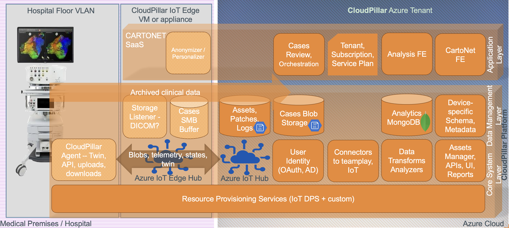

# _CLOUD PILLAR_ for Medical Device Exposure to the Cloud: Vitalizing Healthcare Security & Functionality

## Introduction
The Cloud Pillar is designed to bolster the capabilities of medical devices like CARTO 3 System by integrating advanced cloud functionalities. At its core, this system prioritizes cybersecurity, leveraging the cloud to gain an edge against evolving threats.

## Key Features

- **Cloud Integration & Cybersecurity**: Seamlessly introduce medical devices to the cloud, ensuring data protection and bolstered security measures. 

- **Patient-first**: The system intelligently pauses functionalities when a device is processing patients cases, ensuring zero disruptions.
  
- **Resilience to Network Challenges**: Designed with a robust architecture that gracefully handles intermittent network disruptions, ensuring medical devices remain operational and secure even in fluctuating connectivity environments.
  
- **Cybersecurity Updates**: Proactively equips devices with the latest security patches, safeguarding against evolving cybersecurity threats.
  
- **Device Data Exchange Model**: A comprehensive model that ensures efficient data sharing, synchronization, and communication between devices and the cloud. Devices can upload state updates via Device Twin, Azure IoT Hub's take on the Digital Twin concept, share log files, and relay telemetry data for better system understanding.
  
- **Cloud Wisdom**: The backend isn't just about data management; it's a repository of insights, analytics, and smart decision-making tools that transform raw data into actionable intelligence.
  
- **Platform for Tomorrow's Solutions**: Beyond immediate device management, it establishes a foundational platform-as-a-service, facilitating next-generation medical data analysis cloud applications, including systems like CARTONET™.

## Technology & Integration
The Cloud Pillar for Cybersecurity is anchored in the robust **_Azure IoT_** technologies. This foundation provides a seamless integration platform that not only ensures compatibility with current systems and complex connectivity scenarios, but also paves the way for future innovations. The embracement of Public Key Infrastructure (PKI) and X.509 two-phase device authentication solidifies the system's commitment to security, ensuring data integrity and authentication at every touchpoint. By leveraging latest and greatest, Cloud Pillar offers a strategic and forward-thinking approach to healthcare cybersecurity, positioning Johnson & Johnson at the forefront of digital transformation.

## Benefits for the Healthcare Sector

1. **Enhanced Security**: Regular cybersecurity updates keep medical devices protected against emerging threats.
2. **Operational Efficiency**: Intelligent operations and state maintenance lead to smoother device operations.
3. **Data-Driven Insights**: Backend analysis of logs and telemetry data can lead to actionable insights for better device management.
4. **Future Compatibility**: As the digital transformation of healthcare continues, Cloud Pillar ensures that medical devices are adaptable, secure, and ready to integrate with future systems.

